# Authoritative Master Feature Roadmap & Engineering Blueprints

**Project:** `bilingual-jekyll-resume-theme`  
**Document Status:** Authoritative Master Document (Single Source of Truth)  
**Current Release:** `v0.7.0`  
**Target Release Horizon:** `v0.8.0` (Visual & Core Functional) &rarr; `v0.9.0` (Tooling & CI/CD) &rarr; `v1.0.0` (Ecosystem & Multi-locale)  
**Date:** September 2026  

---

## Executive Summary & Historical Audit Archival

This document establishes the single authoritative master feature roadmap for the `bilingual-jekyll-resume-theme` project. It contains turnkey, production-ready engineering blueprints for all **20 active, uncompleted features** organized across four sequential implementation phases:
1. **Priority 1 (Quick Wins & Visual Polish):** High-visibility, low-friction UX improvements (5 active features).
2. **Priority 2 (Core Functional & Architectural):** Data richness, typography, print fidelity, and accessibility (6 active features).
3. **Priority 3 (Interoperability, Tooling & CI/CD):** Industry schema standards, validation tooling, and test pipelines (3 active features).
4. **Priority 4 (Ecosystem Expansion):** Generic internationalization, chronology views, contact mechanisms, telemetry, and v1.0.0 deprecation retirement (6 active features).

### Historical Remediation Archival Notice
In accordance with repository governance and engineering hygiene rules, **all 18 completed remediation tasks (P0.1 through P0.16, P1.4 Configurable Avatar, and P2.4 Universal Dark Mode & Error Suite) have been audited, verified in git history up to release `v0.7.0`, and purged from active roadmap phases**. 

For complete historical records, commit SHAs, root cause analyses, before-and-after code diffs, and verification commands for these 18 completed items, refer to the dedicated audit archive:
👉 **[`docs/COMPLETED_AUDIT.md`](docs/COMPLETED_AUDIT.md)**

---

## 1. Active Features Master Matrix

All 20 active features are mapped below with their canonical GitHub issue references, auto-closing syntax, effort ratings, demand assessments, and target files.

| Phase | ID | Feature Title | Canonical Issue | Auto-Closing Reference | Effort | Demand | Time Est. | Target Files Key |
|---|---|---|---|---|---|---|---|---|
| **P1** | **1.1** | Predefined Color Themes Palette Engine (5 Palettes) | [#7](https://github.com/kmutahar/bilingual-jekyll-resume-theme/issues/7) | `Closes #7` | ⭐⭐ | High | 2–3 hrs | `_sass/_themes.scss`, `_variables.scss`, layouts |
| **P1** | **1.2** | Interactive Bilingual Language Switcher (EN ⇋ AR) | [#11](https://github.com/kmutahar/bilingual-jekyll-resume-theme/issues/11) | `Closes #11` | ⭐⭐ | High | 2 hrs | `_includes/language-switcher.html`, layouts, SCSS |
| **P1** | **1.3** | Expanded Modern Social Media Platforms (9 Platforms) | [#204](https://github.com/kmutahar/bilingual-jekyll-resume-theme/issues/204) | `Closes #204` | ⭐⭐ | Med-High | 1–2 hrs | `_includes/social-links.html`, LineIcons SVGs |
| **P1** | **1.5** | Dynamic Contact / Resume QR Code Component | [#14](https://github.com/kmutahar/bilingual-jekyll-resume-theme/issues/14) | `Closes #14` | ⭐⭐ | Low-Med | 1–2 hrs | `_includes/qr-code.html`, layouts, SCSS |
| **P1** | **1.6** | Achievement Badges & Credential Icons | [#19](https://github.com/kmutahar/bilingual-jekyll-resume-theme/issues/19) | `Closes #19` | ⭐⭐ | Low-Med | 1–2 hrs | `_includes/badge-display.html`, sections, SCSS |
| **P2** | **2.1** | Comprehensive JSON-LD Structured Data (ATS/SEO) | [#9](https://github.com/kmutahar/bilingual-jekyll-resume-theme/issues/9) | `Closes #9` | ⭐⭐ | High | 3–4 hrs | `_includes/json-ld-resume.html`, layouts |
| **P2** | **2.2** | Skills Level Indicators & Visual Progress Bars | [#10](https://github.com/kmutahar/bilingual-jekyll-resume-theme/issues/10) | `Closes #10` | ⭐⭐ | Med-High | 3–4 hrs | `_includes/skill-level-bar.html`, sections, SCSS |
| **P2** | **2.3** | Professional Print Pagination & Spacing Engine | [#12](https://github.com/kmutahar/bilingual-jekyll-resume-theme/issues/12) | `Closes #12` | ⭐⭐ | High | 2–3 hrs | `_sass/_print-optimization.scss`, `_resume.scss` |
| **P2** | **2.5** | Skills Taxonomy & Categorized Tagging System | [#18](https://github.com/kmutahar/bilingual-jekyll-resume-theme/issues/18) | `Closes #18` | ⭐⭐ | Low | 2–3 hrs | `_includes/resume-section-*.html`, `skills.yml` |
| **P2** | **2.6** | Social Media Cards Generation (Open Graph & Twitter) | [#22](https://github.com/kmutahar/bilingual-jekyll-resume-theme/issues/22) | `Closes #22` | ⭐⭐ | Med-High | 2–3 hrs | `_includes/shared-head.html`, SEO guides |
| **P2** | **2.7** | Advanced WCAG 2.1 AA Accessibility Polish | [#21](https://github.com/kmutahar/bilingual-jekyll-resume-theme/issues/21) | `Closes #21` | ⭐⭐⭐ | Medium | 2–3 hrs | `_sass/_base.scss`, skip-links, landmark roles |
| **P3** | **3.1** | Standard JSON Resume Exporter (`/resume.json`) | [#6](https://github.com/kmutahar/bilingual-jekyll-resume-theme/issues/6) | `Closes #6` | ⭐⭐⭐ | High | 4–5 hrs | `resume.json`, `resume-ar.json` |
| **P3** | **3.2** | Automated CI/CD Build & Verification Pipeline | [#206](https://github.com/kmutahar/bilingual-jekyll-resume-theme/issues/206) | `Closes #206` | ⭐⭐ | High | 2–3 hrs | `.github/workflows/ci.yml` |
| **P3** | **3.3** | YAML Resume Data Validator & Schema Linter | [#13](https://github.com/kmutahar/bilingual-jekyll-resume-theme/issues/13) | `Closes #13` | ⭐⭐⭐ | Med-High | 4–5 hrs | `bin/validate-resume`, `Rakefile` |
| **P4** | **4.1** | Extended Multilingual Support Beyond EN/AR | [#15](https://github.com/kmutahar/bilingual-jekyll-resume-theme/issues/15) | `Closes #15` | ⭐⭐⭐⭐ | Medium | 8–10 hrs | `_data/locales/*.yml`, `resume-multi.html` |
| **P4** | **4.2** | Interactive Career Timeline Visualization | [#16](https://github.com/kmutahar/bilingual-jekyll-resume-theme/issues/16) | `Closes #16` | ⭐⭐⭐⭐ | Low-Med | 6–8 hrs | `_layouts/resume-timeline.html`, `_timeline.scss` |
| **P4** | **4.3** | Secure Contact Form Integration (Formspree/Netlify) | [#20](https://github.com/kmutahar/bilingual-jekyll-resume-theme/issues/20) | `Closes #20` | ⭐⭐⭐ | Low-Med | 3–4 hrs | `_includes/contact-form.html`, layouts, SCSS |
| **P4** | **4.4** | Privacy-First Resume Engagement Analytics | [#17](https://github.com/kmutahar/bilingual-jekyll-resume-theme/issues/17) | `Closes #17` | ⭐⭐⭐ | Low-Med | 3–4 hrs | `assets/js/resume-analytics.js`, analytics body |
| **P4** | **4.5** | Resume Comparison & A/B Testing View | [#23](https://github.com/kmutahar/bilingual-jekyll-resume-theme/issues/23) | `Closes #23` | ⭐⭐⭐ | Low | 4–5 hrs | `_layouts/resume-comparison.html`, `_comparison.scss` |
| **P4** | **4.6** | Deprecation Retirement & Legacy Fallbacks Cleanup | [#214](https://github.com/kmutahar/bilingual-jekyll-resume-theme/issues/214) | `Closes #214` | ⭐ | High | 1–2 hrs | `_includes/resume-section-*.html`, layouts, docs |

*(Note on Canonical References: Issue #204 is canonical for Expanded Social Media, superseding redundant duplicates #36–#190. Issue #206 is canonical for Automated CI/CD Pipeline, superseding redundant duplicates #38–#192).*

---

## 2. Architecture & Dependency Flow

The diagram below illustrates the architectural relationships, token flows, and sequential dependencies connecting all 20 active features across the four priority phases.

```mermaid
flowchart TD
    subgraph P1["Priority 1: Quick Wins & High-Impact Visuals"]
        F11["1.1 Theme Palettes Engine (5 Palettes)<br/>#7"]
        F12["1.2 Bilingual Language Switcher (EN ⇋ AR)<br/>#11"]
        F13["1.3 Expanded Social Media (9 Platforms)<br/>#204"]
        F15["1.5 Dynamic QR Code Component<br/>#14"]
        F16["1.6 Achievement Badges & Icons<br/>#19"]
    end

    subgraph P2["Priority 2: Core Functional & Architectural"]
        F21["2.1 JSON-LD Structured Data (ATS/SEO)<br/>#9"]
        F22["2.2 Skills Level Bars & ARIA Meters<br/>#10"]
        F23["2.3 Professional Print Pagination Engine<br/>#12"]
        F25["2.5 Skills Taxonomy & Tagging<br/>#18"]
        F26["2.6 Social Cards (OG & Twitter)<br/>#22"]
        F27["2.7 WCAG 2.1 AA Accessibility Polish<br/>#21"]
    end

    subgraph P3["Priority 3: Interoperability, Tooling & CI/CD"]
        F31["3.1 JSON Resume Exporter (/resume.json)<br/>#6"]
        F32["3.2 Automated CI/CD Pipeline (GitHub Actions)<br/>#206"]
        F33["3.3 YAML Data Validator CLI & Schema Linter<br/>#13"]
    end

    subgraph P4["Priority 4: Ecosystem Expansion"]
        F41["4.1 Multilingual System (ES, FR, DE, UR)<br/>#15"]
        F42["4.2 Interactive Career Timeline Layout<br/>#16"]
        F43["4.3 Secure Contact Form (Formspree/Netlify)<br/>#20"]
        F44["4.4 Privacy Engagement Analytics<br/>#17"]
        F45["4.5 Resume Comparison & A/B View<br/>#23"]
        F46["4.6 Deprecation Retirement (v1.0.0)<br/>#214"]
    end

    %% Dependencies & Synergies
    F11 -->|CSS Design Tokens| F22
    F11 -->|Color Variables| F42
    F12 -->|Bilingual Navigation| F41
    F13 -->|Profile URLs| F21
    F13 -->|Social Network Links| F31
    F15 -->|Print Visibility Rules| F23
    F16 -->|Credential Entities| F21
    F22 -->|Skill Proficiency Values| F25
    F22 -->|Skill Metadata| F31
    F23 -->|Print Page Bounds| F42
    F27 -->|Accessible Focus Rings| F12
    F27 -->|ARIA Standards| F43
    F33 -->|Schema Validation Gate| F32
    F33 -->|Schema Validation Gate| F46
    F31 -->|Interoperable Resume Data| F45
```



---

## 3. Priority 1: Quick Wins & High-Impact Visual Blueprints

---

### Feature 1.1: Predefined Color Themes Palette Engine (5 Palettes)

- **Canonical Issue:** [#7](https://github.com/kmutahar/bilingual-jekyll-resume-theme/issues/7)
- **Auto-Closing Reference:** `Closes #7`
- **Canonical URL:** `https://github.com/kmutahar/bilingual-jekyll-resume-theme/issues/7`
- **Concept & User Demand Rationale:**  
  Candidates across different disciplines require visual presentation aligned with industry norms. While software engineers prefer modern blues, finance/health professionals prefer greens, corporate legal roles require navy, and academics prefer burgundy. Introducing 5 curated color themes through CSS Custom Properties enables zero-code palette switching via `_config.yml` while preserving full light/dark mode support.
- **Effort / Impact / Demand:** Effort: ⭐⭐ (2–3 hrs) | Impact: ⭐⭐⭐⭐⭐ | Demand: High

#### Exact Target Files
- **Files to Create:**
  - `_sass/_themes.scss`
  - `docs/THEMES_GUIDE.md`
- **Files to Modify:**
  - `_sass/_variables.scss` (define fallback token defaults)
  - `_sass/_dark-mode.scss` (ensure dark mode token cascade overrides)
  - `assets/css/cv.scss` (add `@use "themes";`)
  - `assets/css/cv-ar.scss` (add `@use "themes";`)
  - `assets/css/main.scss` (add `@use "themes";`)
  - `_layouts/resume-en.html` (inject `class="theme-{{ site.resume_theme | default: 'default' }}"` on `<body>`)
  - `_layouts/resume-ar.html` (inject `class="theme-{{ site.resume_theme | default: 'default' }}"` on `<body>`)
  - `_layouts/default.html` (support theme class on default body)
  - `docs/_data/_config.sample.yml`
  - `docs/CONFIG_GUIDE.md`

#### Data Models & Configuration
In `_config.yml` and `docs/_data/_config.sample.yml`:
```yaml
# ==============================================================================
# Resume Color Theme Palette
# ==============================================================================
# Select active aesthetic theme palette.
# Options:
#   - default         : Classic Slate & Steel Blue (General / Baseline)
#   - modern-blue     : Vibrant Azure & Deep Royal (Tech, Software & Startups)
#   - emerald-green   : Emerald & Deep Forest (Finance, ESG & Life Sciences)
#   - corporate-navy  : Deep Indigo & Slate Navy (Consulting, Law & Enterprise)
#   - warm-burgundy   : Rich Rose & Deep Bordeaux (Design, Academia & Arts)
resume_theme: "modern-blue"
```

#### Architecture & Liquid/SCSS Implementation
Create `_sass/_themes.scss`:
```scss
// ==========================================================================
// Predefined Color Themes Engine
// bilingual-jekyll-resume-theme
// ==========================================================================

// 1. Modern Blue (Tech & Engineering)
body.theme-modern-blue {
  --accent-color: #2563eb;
  --accent-hover: #1d4ed8;
  --accent-hover-color: #1d4ed8;
  --border-color: #dbeafe;
  --card-bg: #eff6ff;
  --button-hover-bg: #2563eb;
  --button-hover-text: #ffffff;
}
html[data-theme="dark"] body.theme-modern-blue {
  --accent-color: #60a5fa;
  --accent-hover: #93c5fd;
  --accent-hover-color: #93c5fd;
  --border-color: #1e3a8a;
  --card-bg: #172554;
}

// 2. Emerald Green (Finance, ESG & Health Sciences)
body.theme-emerald-green {
  --accent-color: #059669;
  --accent-hover: #047857;
  --accent-hover-color: #047857;
  --border-color: #d1fae5;
  --card-bg: #ecfdf5;
  --button-hover-bg: #059669;
  --button-hover-text: #ffffff;
}
html[data-theme="dark"] body.theme-emerald-green {
  --accent-color: #34d399;
  --accent-hover: #6ee7b7;
  --accent-hover-color: #6ee7b7;
  --border-color: #064e3b;
  --card-bg: #062e24;
}

// 3. Corporate Navy (Consulting, Corporate & Legal)
body.theme-corporate-navy {
  --accent-color: #1e3a8a;
  --accent-hover: #172554;
  --accent-hover-color: #172554;
  --border-color: #cbd5e1;
  --card-bg: #f8fafc;
  --button-hover-bg: #1e3a8a;
  --button-hover-text: #ffffff;
}
html[data-theme="dark"] body.theme-corporate-navy {
  --accent-color: #93c5fd;
  --accent-hover: #bfdbfe;
  --accent-hover-color: #bfdbfe;
  --border-color: #1e293b;
  --card-bg: #0f172a;
}

// 4. Warm Burgundy (Academia, Arts & Editorial Design)
body.theme-warm-burgundy {
  --accent-color: #9f1239;
  --accent-hover: #881337;
  --accent-hover-color: #881337;
  --border-color: #ffe4e6;
  --card-bg: #fff1f2;
  --button-hover-bg: #9f1239;
  --button-hover-text: #ffffff;
}
html[data-theme="dark"] body.theme-warm-burgundy {
  --accent-color: #fb7185;
  --accent-hover: #fda4af;
  --accent-hover-color: #fda4af;
  --border-color: #4c0519;
  --card-bg: #2b0410;
}
```

In `_layouts/resume-en.html` and `_layouts/resume-ar.html`:
```liquid
<body class="layout-resume-{{ page.lang | default: 'en' }} theme-{{ site.resume_theme | default: 'default' }}">
```

#### Acceptance Criteria & Verification
- [ ] Setting `resume_theme: "emerald-green"` in `_config.yml` applies `theme-emerald-green` to `<body>`.
- [ ] Primary headers, contact buttons, and active accent elements switch to the palette's `--accent-color`.
- [ ] Dark mode toggle preserves distinct theme colors without reverting to default slate.
- [ ] Omitting `resume_theme` safely defaults to classic slate/blue with zero console errors.
- [ ] **Bash Verification Command:**
  ```bash
  bundle exec jekyll build --strict_front_matter && \
  grep -q "theme-" _site/index.html && \
  echo "Theme classes compiled cleanly."
  ```

#### Git Workflow Specification
- **Branch:** `feature/color-themes`
- **PR Title:** `feat(theming): introduce 5 predefined professional color palettes`
- **Conventional Commit:** `feat(theming): add 5 predefined color theme palettes (Closes #7)`
- **Issue Reference:** `https://github.com/kmutahar/bilingual-jekyll-resume-theme/issues/7`

---

### Feature 1.2: Interactive Bilingual Language Switcher (EN ⇋ AR)

- **Canonical Issue:** [#11](https://github.com/kmutahar/bilingual-jekyll-resume-theme/issues/11)
- **Auto-Closing Reference:** `Closes #11`
- **Canonical URL:** `https://github.com/kmutahar/bilingual-jekyll-resume-theme/issues/11`
- **Concept & User Demand Rationale:**  
  Visitors to a bilingual resume site require an immediate, obvious, and accessible mechanism to toggle between the English and Arabic versions of the document. The language switcher component floats symmetrically opposite the dark mode toggle, preserves viewport ergonomics, and is hidden during printing.
- **Effort / Impact / Demand:** Effort: ⭐⭐ (2 hrs) | Impact: ⭐⭐⭐⭐⭐ | Demand: High

#### Exact Target Files
- **Files to Create:**
  - `_includes/language-switcher.html`
- **Files to Modify:**
  - `_layouts/resume-en.html` (include `language-switcher.html`)
  - `_layouts/resume-ar.html` (include `language-switcher.html`)
  - `_layouts/default.html` (include `language-switcher.html` when enabled)
  - `_sass/_layout.scss` (floating pill styles and positioning)
  - `_sass/_resume-rtl.scss` (RTL coordinate flip)
  - `docs/_data/_config.sample.yml`
  - `docs/CONFIG_GUIDE.md`
  - `docs/INCLUDES_GUIDE.md`

#### Data Models & Configuration
In `_config.yml`:
```yaml
# ==============================================================================
# Interactive Bilingual Switcher
# ==============================================================================
# Enables the floating EN <-> AR toggle component on resume layouts
resume_language_switcher: true # Set to false to disable
resume_en_url: "/resume/en/"   # Fallback English destination
resume_ar_url: "/resume/ar/"   # Fallback Arabic destination
```

#### Architecture & Liquid/SCSS Implementation
Create `_includes/language-switcher.html`:
```liquid

Include: Reusable Language Switcher Component
- Invariant: Automatically discovers counterpart localized page via page.t_id or default paths.
- Accessibility: Localized aria-label and title attributes with keyboard focus indicator.



  
  
  
    
  

  
  
    
    
      
    
  

  
    
      
    
      
    
  

  <div class="language-switcher no-print" role="navigation" aria-label="Language Selector">
    <a href="{{ target_url }}"
       class="lang-switch-btn"
       aria-label="Switch language to Englishالتحويل إلى اللغة العربية"
       title="Englishالعربية">
      <span class="lang-icon" aria-hidden="true">🌐</span>
      <span class="lang-label-target">ENعربي</span>
    </a>
  </div>

```

Styling in `_sass/_layout.scss` & `_sass/_resume-rtl.scss`:
```scss
// In _sass/_layout.scss (LTR baseline: Top-Left, Dark-mode is Top-Right)
.language-switcher {
  position: fixed;
  top: 1.25rem;
  left: 1.25rem;
  z-index: 1000;

  .lang-switch-btn {
    display: inline-flex;
    align-items: center;
    justify-content: center;
    gap: 0.35rem;
    height: 2.5rem;
    padding: 0 0.85rem;
    background: var(--bg-color, #ffffff);
    color: var(--text-color, #333333);
    border: 1px solid var(--border-color, #e0e0e0);
    border-radius: 9999px;
    text-decoration: none;
    font-size: 0.85rem;
    font-weight: 700;
    box-shadow: 0 2px 8px rgba(0, 0, 0, 0.1);
    transition: all 0.2s ease;

    &:hover {
      background: var(--button-bg, #f5f5f5);
      border-color: var(--accent-color, #007acc);
      transform: scale(1.05);
    }

    &:focus-visible {
      outline: 2px solid var(--accent-color, #007acc);
      outline-offset: 2px;
    }
  }
}

// In _sass/_resume-rtl.scss (RTL coordinate flip: Top-Right, Dark-mode is Top-Left)
html[dir="rtl"] {
  .language-switcher {
    left: auto;
    right: 1.25rem;
  }
}
```

#### Acceptance Criteria & Verification
- [ ] Switcher renders on English resume at top-left with text "عربي". Clicking navigates to Arabic resume.
- [ ] Switcher renders on Arabic resume at top-right with text "EN". Clicking navigates to English resume.
- [ ] Both buttons display descriptive localized `aria-label` tags for screen readers.
- [ ] Component includes `.no-print` and does not appear on printed sheets.
- [ ] Setting `resume_language_switcher: false` suppresses component rendering.
- [ ] **Bash Verification Command:**
  ```bash
  bundle exec jekyll build && \
  grep -q "lang-switch-btn" _site/resume/en/index.html && \
  grep -q "lang-switch-btn" _site/resume/ar/index.html && \
  echo "Bilingual switcher verified on both layouts."
  ```

#### Git Workflow Specification
- **Branch:** `feature/language-switcher`
- **PR Title:** `feat(i18n): add responsive bilingual language switcher component`
- **Conventional Commit:** `feat(i18n): implement interactive bilingual language switcher (Closes #11)`
- **Issue Reference:** `https://github.com/kmutahar/bilingual-jekyll-resume-theme/issues/11`

---

### Feature 1.3: Expanded Modern Social Media Platforms (9 Platforms)

- **Canonical Issue:** [#204](https://github.com/kmutahar/bilingual-jekyll-resume-theme/issues/204)
- **Auto-Closing Reference:** `Closes #204`
- **Canonical URL:** `https://github.com/kmutahar/bilingual-jekyll-resume-theme/issues/204`
- **Duplicate Issues Closed with Cross-Reference:** #36, #50, #64, #78, #92, #106, #120, #134, #148, #162, #176, #190
- **Concept & User Demand Rationale:**  
  The theme currently supports 14 legacy platforms but lacks modern developer networks (Bluesky, Threads, Mastodon, Discord), developer repositories (GitLab), newsletter platforms (Substack), design portfolios (Behance), and academic citations (Google Scholar, ORCID). Mastodon requires `rel="me"` for decentralized identity verification.
- **Effort / Impact / Demand:** Effort: ⭐⭐ (1–2 hrs) | Impact: ⭐⭐⭐⭐ | Demand: Med-High

#### Exact Target Files
- **Files to Create (SVGs in `_includes/vendors/lineicons-v5.0/`):**
  - `mastodon.svg`
  - `discord.svg`
  - `bluesky.svg`
  - `threads.svg`
  - `substack.svg`
  - `gitlab.svg`
  - `google-scholar.svg`
  - `orcid.svg`
  - `behance.svg`
- **Files to Modify:**
  - `_includes/social-links.html` (add Liquid blocks with WCAG labels, `rel="me"`)
  - `_includes/print-social-links.html` (add bilingual print entries with `<span dir="ltr">`)
  - `docs/_data/_config.sample.yml`
  - `docs/CONFIG_GUIDE.md`

#### Data Models & Configuration
In `_config.yml` and `docs/_data/_config.sample.yml`:
```yaml
social_links:
  github: "https://github.com/yourusername"
  linkedin: "https://www.linkedin.com/in/yourhandle/"
  # Modern & Academic Networks:
  mastodon: "https://mastodon.social/@yourhandle"
  discord: "https://discord.com/users/yourid"
  bluesky: "https://bsky.app/profile/yourhandle.bsky.social"
  threads: "https://www.threads.net/@yourhandle"
  substack: "https://yourhandle.substack.com"
  gitlab: "https://gitlab.com/yourhandle"
  google_scholar: "https://scholar.google.com/citations?user=yourid"
  orcid: "https://orcid.org/0000-0002-1825-0097"
  behance: "https://www.behance.net/yourhandle"
```

#### Architecture & Liquid/SCSS Implementation
In `_includes/social-links.html`:
```liquid

  <!-- Mastodon with Fediverse rel="me" verification -->
  <li class="icon-link-item">
    <a href="{{ site.social_links.mastodon }}" class="icon-link" itemprop="sameAs" target="_blank" rel="me noopener nofollow noreferrer" aria-label="Mastodon" title="Mastodon">
      
      <span class="sr-only">Mastodon</span>
    </a>
  </li>



  <!-- Bluesky -->
  <li class="icon-link-item">
    <a href="{{ site.social_links.bluesky }}" class="icon-link" itemprop="sameAs" target="_blank" rel="noopener nofollow noreferrer" aria-label="Bluesky" title="Bluesky">
      
      <span class="sr-only">Bluesky</span>
    </a>
  </li>

```

In `_includes/print-social-links.html`:
```liquid

  <li><strong>ماستودون (Mastodon)Mastodon</strong>: <span dir="ltr">{{ site.social_links.mastodon }}</span></li>


  <li><strong>بلو سكاي (Bluesky)Bluesky</strong>: <span dir="ltr">{{ site.social_links.bluesky }}</span></li>


  <li><strong>باحث جوجل (Google Scholar)Google Scholar</strong>: <span dir="ltr">{{ site.social_links.google_scholar }}</span></li>

```

#### Acceptance Criteria & Verification
- [ ] All 9 platforms render clean 20x20px vector icons.
- [ ] Mastodon anchor includes `rel="me"` attribute.
- [ ] All SVGs include `aria-hidden="true" focusable="false"` with `.sr-only` text.
- [ ] Printed Arabic resumes output platform names with directionally isolated `<span dir="ltr">` URLs.
- [ ] **Bash Verification Command:**
  ```bash
  grep -rn 'rel="me' _includes/social-links.html && \
  ls -1 _includes/vendors/lineicons-v5.0/{mastodon,bluesky,discord,gitlab,orcid}.svg && \
  echo "Social platform assets verified."
  ```

#### Git Workflow Specification
- **Branch:** `feature/expanded-social-icons`
- **PR Title:** `feat(social): add 9 modern and academic social media platforms`
- **Conventional Commit:** `feat(social): add Mastodon, Bluesky, Discord, and Scholar icons (Closes #204)`
- **Issue Reference:** `https://github.com/kmutahar/bilingual-jekyll-resume-theme/issues/204`

---

### Feature 1.5: Dynamic Contact / Resume QR Code Component

- **Canonical Issue:** [#14](https://github.com/kmutahar/bilingual-jekyll-resume-theme/issues/14)
- **Auto-Closing Reference:** `Closes #14`
- **Canonical URL:** `https://github.com/kmutahar/bilingual-jekyll-resume-theme/issues/14`
- **Concept & User Demand Rationale:**  
  Printed paper resumes and static PDF exports cannot be clicked. A scannable, high-contrast QR code bridging physical handouts with the live online portfolio or vCard contact profile allows recruiters at career fairs and interviews to instantaneously access the full web resume.
- **Effort / Impact / Demand:** Effort: ⭐⭐ (1–2 hrs) | Impact: ⭐⭐⭐ | Demand: Low-Med

#### Exact Target Files
- **Files to Create:**
  - `_includes/qr-code.html`
- **Files to Modify:**
  - `_layouts/resume-en.html` (embed QR component)
  - `_layouts/resume-ar.html` (embed QR component)
  - `_sass/_resume.scss` (positioning and print styling)
  - `docs/_data/_config.sample.yml`
  - `docs/CONFIG_GUIDE.md`
  - `docs/INCLUDES_GUIDE.md`

#### Data Models & Configuration
In `_config.yml`:
```yaml
# ==============================================================================
# Resume QR Code
# ==============================================================================
resume_show_qr_code: true       # Master toggle (default: false)
resume_qr_code_print_only: true # Show strictly when printing / PDF export (default: true)
resume_qr_code_size: 96         # Square size in pixels (default: 96)
```

#### Architecture & Liquid/SCSS Implementation
Create `_includes/qr-code.html`:
```liquid

Include: Dynamic Resume QR Code Component
- Invariant: Generates privacy-respecting vector QR code referencing canonical page URL.
- Print Mode: Symmetrically anchors to resume header corner in print media.



  
  
    
  
  
  
  

  
  
  
    
    
  

  

  <div class="resume-qr-wrapper print-only" role="complementary" aria-label="Resume QR Code">
    
    <span class="resume-qr-caption">{{ qr_caption }}</span>
  </div>

```

Styling in `_sass/_resume.scss`:
```scss
.resume-qr-wrapper {
  display: flex;
  flex-direction: column;
  align-items: center;
  gap: 0.25rem;

  .resume-qr-code {
    border: 1px solid var(--border-color, #e0e0e0);
    padding: 3px;
    background: #ffffff;
    border-radius: 4px;
  }

  .resume-qr-caption {
    font-size: 0.75rem;
    color: var(--text-muted, #777777);
    text-align: center;
  }
}

@media print {
  .resume-qr-wrapper {
    position: absolute;
    top: 1rem;
    right: 1.5rem;
  }

  html[dir="rtl"] .resume-qr-wrapper {
    right: auto;
    left: 1.5rem;
  }
}
```

#### Acceptance Criteria & Verification
- [ ] Setting `resume_show_qr_code: true` renders a valid QR code pointing to `page.url | absolute_url`.
- [ ] If `resume_qr_code_print_only: true`, QR code is hidden on screen and appears only in print output.
- [ ] In Arabic resumes, the caption renders in Arabic and anchors to the top-left in print.
- [ ] **Bash Verification Command:**
  ```bash
  bundle exec jekyll build && \
  grep -q "resume-qr-wrapper" _site/resume/en/index.html && \
  echo "QR code inclusion verified."
  ```

#### Git Workflow Specification
- **Branch:** `feature/qr-code`
- **PR Title:** `feat(resume): add dynamic QR code component for print and digital resumes`
- **Conventional Commit:** `feat(resume): add dynamic QR code include and print styles (Closes #14)`
- **Issue Reference:** `https://github.com/kmutahar/bilingual-jekyll-resume-theme/issues/14`

---

### Feature 1.6: Achievement Badges & Credential Icons

- **Canonical Issue:** [#19](https://github.com/kmutahar/bilingual-jekyll-resume-theme/issues/19)
- **Auto-Closing Reference:** `Closes #19`
- **Canonical URL:** `https://github.com/kmutahar/bilingual-jekyll-resume-theme/issues/19`
- **Concept & User Demand Rationale:**  
  Technical credentials (AWS Certified, Google Cloud Professional, CKA, PMP) issue standardized digital badges through Credly, Accredible, or GitHub. Integrating badges into certifications and recognitions sections improves credibility and candidate distinction.
- **Effort / Impact / Demand:** Effort: ⭐⭐ (1–2 hrs) | Impact: ⭐⭐⭐ | Demand: Low-Med

#### Exact Target Files
- **Files to Create:**
  - `_includes/badge-display.html`
- **Files to Modify:**
  - `_includes/resume-section-en.html` (include `badge-display.html` in certifications & recognitions)
  - `_includes/resume-section-ar.html` (include `badge-display.html` in certifications & recognitions)
  - `_sass/_resume.scss` (`.achievement-badge` dimensions, alignment, hover scale)
  - `docs/_data/en/certifications.yml` (sample badge fields)
  - `docs/_data/ar/certifications.yml` (sample badge fields)
  - `docs/DATA_GUIDE.md`
  - `docs/INCLUDES_GUIDE.md`

#### Data Models & Configuration
In `docs/_data/en/certifications.yml`:
```yaml
# English Certification with Verified Badge
- name: "AWS Certified Solutions Architect – Associate"
  active: true
  issuing_organization: "Amazon Web Services"
  credential_id: "AWS-PSA-78291"
  credential_url: "https://www.credly.com/badges/sample-id"
  badge_url: "https://images.credly.com/size/340x340/images/0e284c41-ae9e-4e4b-bb2d-7043a2bc02cf/image.png"
  issue_date: 2024-05-15
  expiration: 2027-05-15
```

In `docs/_data/ar/certifications.yml`:
```yaml
# شهادة معتمدة مع شارة رقمية موثقة
- name: "مهندس حلول معتمد من أمازون (AWS) – مشارك"
  active: true
  issuing_organization: "أمازون لخدمات الويب (AWS)"
  credential_id: "AWS-PSA-78291"
  credential_url: "https://www.credly.com/badges/sample-id"
  badge_url: "https://images.credly.com/size/340x340/images/0e284c41-ae9e-4e4b-bb2d-7043a2bc02cf/image.png"
  issue_date: 2024-05-15
  expiration: 2027-05-15
```

#### Architecture & Liquid/SCSS Implementation
Create `_includes/badge-display.html`:
```liquid

Include: Achievement Badge Display Component
- Parameters: item (Data item with badge_url, credential_url, and name)



  
  
    
  

  <span class="achievement-badge-container">
    
      <a href="{{ include.item.credential_url }}" target="_blank" rel="noopener nofollow noreferrer" aria-label="Verify {{ include.item.name }} credential badge">
        
      </a>
    
      
    
  </span>

```

Styling in `_sass/_resume.scss`:
```scss
.achievement-badge-container {
  display: inline-flex;
  align-items: center;
  margin-right: 0.5rem;

  .achievement-badge {
    width: 36px;
    height: 36px;
    object-fit: contain;
    border-radius: 4px;
    vertical-align: middle;
    transition: transform 0.2s ease;

    &:hover {
      transform: scale(1.1);
    }
  }
}

html[dir="rtl"] .achievement-badge-container {
  margin-right: 0;
  margin-left: 0.5rem;
}
```

#### Acceptance Criteria & Verification
- [ ] Items configured with `badge_url` render aligned 36x36px badges in both English and Arabic.
- [ ] Badges with `credential_url` wrap in secure external links (`rel="noopener nofollow noreferrer"`).
- [ ] Certifications omitting `badge_url` render normally with zero spacing gaps.
- [ ] **Bash Verification Command:**
  ```bash
  bundle exec jekyll build && \
  grep -q "achievement-badge" _site/resume/en/index.html && \
  echo "Credential badges rendered successfully."
  ```

#### Git Workflow Specification
- **Branch:** `feature/achievement-badges`
- **PR Title:** `feat(resume): support achievement badges and credential icons`
- **Conventional Commit:** `feat(resume): add badge-display include for certifications & awards (Closes #19)`
- **Issue Reference:** `https://github.com/kmutahar/bilingual-jekyll-resume-theme/issues/19`

---

## 4. Priority 2: Core Functional & Architectural Blueprints

---

### Feature 2.1: Comprehensive JSON-LD Structured Data (ATS/SEO)

- **Canonical Issue:** [#9](https://github.com/kmutahar/bilingual-jekyll-resume-theme/issues/9)
- **Auto-Closing Reference:** `Closes #9`
- **Canonical URL:** `https://github.com/kmutahar/bilingual-jekyll-resume-theme/issues/9`
- **Concept & User Demand Rationale:**  
  While microdata attributes exist on HTML tags, search crawlers (Google Search Console) and Applicant Tracking Systems (ATS parsers) require unified Schema.org JSON-LD scripts in `<head>`. A rich structured graph representing `Person` with nested `hasOccupation` (`Role`), `alumniOf` (`CollegeOrUniversity`), and `knowsAbout` (`skills`) dramatically improves ranking and automated recruitment indexing.
- **Effort / Impact / Demand:** Effort: ⭐⭐ (3–4 hrs) | Impact: ⭐⭐⭐⭐⭐ | Demand: High

#### Exact Target Files
- **Files to Create:**
  - `_includes/json-ld-resume.html`
  - `docs/SEO_GUIDE.md`
- **Files to Modify:**
  - `_layouts/resume-en.html` (include `json-ld-resume.html` in `<head>`)
  - `_layouts/resume-ar.html` (include `json-ld-resume.html` in `<head>`)
  - `docs/INCLUDES_GUIDE.md`

#### Data Models & Configuration
Utilizes existing bilingual data files (`_data/en/*.yml`, `_data/ar/*.yml`, `_config.yml`).

#### Architecture & Liquid/SCSS Implementation
Create `_includes/json-ld-resume.html`:
```liquid

Include: Comprehensive JSON-LD Structured Data Graph
- Conforms to: Schema.org/Person, Schema.org/Role, Schema.org/PostalAddress
- Escaping: String values wrapped with | jsonify to prevent JSON injection


<script type="application/ld+json">
{
  "@context": "https://schema.org",
  "@type": "Person",
  "name": "{{ site.name_ar.first }} {{ site.name_ar.last }}{{ site.name.first }} {{ site.name.last }}",
  "jobTitle": "{{ site.resume_title_ar }}{{ site.resume_title }}",
  "url": "{{ page.url | absolute_url }}",
  "image": "{{ site.avatar_url | default: '/assets/images/Profile-min.jpg' | absolute_url }}",
  "email": "mailto:{{ site.contact_info.email }}",
  
  "telephone": "{{ site.contact_info.phone }}",
  
  
  "address": {
    "@type": "PostalAddress",
    "addressLocality": "{{ site.contact_info.address_ar }}{{ site.contact_info.address }}"
  },
  
  "sameAs": [
    
    
      
        ,"{{ social[1] }}"
        
      
    
  ]
  
  ,"knowsAbout": [
    
    
      
        ,{{ s.skill | jsonify }}
        
      
    
  ]
  
  
  ,"hasOccupation": [
    
    
      
        ,
        {
          "@type": "Role",
          "roleName": {{ exp.position | jsonify }},
          "startDate": "{{ exp.startdate | date: '%Y-%m' }}",
          "endDate": "Present{{ exp.enddate | date: '%Y-%m' }}",
          "worksFor": {
            "@type": "Organization",
            "name": {{ exp.company | jsonify }}
            ,"location": {{ exp.location | jsonify }}
          }
        }
        
      
    
  ]
  
  
  ,"alumniOf": [
    
    
      
        ,
        {
          "@type": "CollegeOrUniversity",
          "name": {{ edu.uni | jsonify }}
          ,"location": {{ edu.location | jsonify }}
        }
        
      
    
  ]
  
}
</script>
```

#### Acceptance Criteria & Verification
- [ ] Both `/resume/en/` and `/resume/ar/` output syntactically valid `<script type="application/ld+json">`.
- [ ] Output validates in Google Rich Results Test and Schema.org Validator with 0 errors.
- [ ] Arabic characters, double quotes, and punctuation are safely escaped via `| jsonify`.
- [ ] **Bash Verification Command:**
  ```bash
  bundle exec jekyll build && \
  ruby -rjson -e '
    ["_site/resume/en/index.html", "_site/resume/ar/index.html"].each do |f|
      html = File.read(f)
      match = html.match(/<script type="application\/ld\+json">([\s\S]*?)<\/script>/)
      raise "Missing JSON-LD in #{f}" unless match
      JSON.parse(match[1])
    end
    puts "JSON-LD syntax verified across EN and AR layouts."
  '
  ```

#### Git Workflow Specification
- **Branch:** `feature/json-ld-structured-data`
- **PR Title:** `feat(seo): embed comprehensive Schema.org JSON-LD structured data`
- **Conventional Commit:** `feat(seo): implement rich Person and Role JSON-LD in resume layouts (Closes #9)`
- **Issue Reference:** `https://github.com/kmutahar/bilingual-jekyll-resume-theme/issues/9`

---

### Feature 2.2: Skills Level Indicators & Visual Progress Bars

- **Canonical Issue:** [#10](https://github.com/kmutahar/bilingual-jekyll-resume-theme/issues/10)
- **Auto-Closing Reference:** `Closes #10`
- **Canonical URL:** `https://github.com/kmutahar/bilingual-jekyll-resume-theme/issues/10`
- **Concept & User Demand Rationale:**  
  Technical roles often require differentiating core competencies from foundational skills. Providing optional numerical proficiency values (1–5 scale or 1–100%) rendered via accessible progress bars (`role="progressbar"`) allows visual scanning while retaining text descriptions.
- **Effort / Impact / Demand:** Effort: ⭐⭐ (3–4 hrs) | Impact: ⭐⭐⭐⭐ | Demand: Med-High

#### Exact Target Files
- **Files to Create:**
  - `_includes/skill-level-bar.html`
- **Files to Modify:**
  - `_includes/resume-section-en.html` (call `skill-level-bar.html`)
  - `_includes/resume-section-ar.html` (call `skill-level-bar.html`)
  - `_sass/_resume.scss` (`.skill-meter` styling, accessible colors, print overrides)
  - `docs/_data/en/skills.yml` (sample proficiency values)
  - `docs/_data/ar/skills.yml` (sample proficiency values)
  - `docs/DATA_GUIDE.md`
  - `docs/CONFIG_GUIDE.md`

#### Data Models & Configuration
In `docs/_data/en/skills.yml`:
```yaml
- skill: "TypeScript & Node.js"
  active: true
  level: 5                  # Integer 1 to 5, or percentage (1 to 100)
  level_label: "Expert"     # Optional textual indicator
  description: "Architecting enterprise microservices and reactive UIs."

- skill: "Python & PyTorch"
  active: true
  level: 4
  level_label: "Advanced"
```

In `docs/_data/ar/skills.yml`:
```yaml
- skill: "تايب سكريبت ونود جي إس (Node.js)"
  active: true
  level: 5
  level_label: "خبير"
  description: "بناء معمارية الخدمات المصغرة الموزعة وواجهات المستخدم التفاعلية."

- skill: "بايثون وباي تورش (PyTorch)"
  active: true
  level: 4
  level_label: "متقدم"
```

In `_config.yml`:
```yaml
resume_skills_visualization: true # Display visual progress indicators (default: false)
```

#### Architecture & Liquid/SCSS Implementation
Create `_includes/skill-level-bar.html`:
```liquid

Include: Skills Level Visualizer
- Invariant: Implements WAI-ARIA progressbar pattern with screen-reader value announcements.
- RTL: Fills naturally from right to left under dir="rtl".



  
  
    
    
    
  
    
    
    
  

  <div class="skill-meter-container">
    
      <span class="skill-meter-label">{{ include.skill.level_label }}</span>
    
    <div class="skill-meter"
         role="progressbar"
         aria-valuenow="{{ val_now }}"
         aria-valuemin="0"
         aria-valuemax="{{ val_max }}"
         aria-label="{{ include.skill.skill }} proficiency: {{ val_now }} of {{ val_max }}">
      <div class="skill-meter-fill" style="width: {{ pct }}%;"></div>
    </div>
  </div>

```

Styling in `_sass/_resume.scss`:
```scss
.skill-meter-container {
  display: flex;
  align-items: center;
  gap: 0.75rem;
  margin: 0.25rem 0 0.5rem;

  .skill-meter-label {
    font-size: 0.8rem;
    font-weight: 600;
    color: var(--text-light, #666666);
    min-width: 4rem;
  }

  .skill-meter {
    flex: 1;
    max-width: 180px;
    height: 6px;
    background: var(--border-color, #e0e0e0);
    border-radius: 3px;
    overflow: hidden;

    .skill-meter-fill {
      height: 100%;
      background: var(--accent-color, #007acc);
      border-radius: 3px;
      transition: width 0.4s ease;
    }
  }
}

@media print {
  .skill-meter {
    border: 1px solid #777777 !important;
    background: #eeeeee !important;

    .skill-meter-fill {
      background: #333333 !important;
    }
  }
}
```

#### Acceptance Criteria & Verification
- [ ] Skills with `level` render progress meters when `resume_skills_visualization: true`.
- [ ] Includes `role="progressbar"` with accurate `aria-valuenow`, `aria-valuemin`, and `aria-valuemax`.
- [ ] Omitting `level` suppresses meter DOM output cleanly without whitespace.
- [ ] Meter fill renders from right-to-left in Arabic RTL orientation.
- [ ] **Bash Verification Command:**
  ```bash
  bundle exec jekyll build && \
  grep -q 'role="progressbar"' _site/resume/en/index.html && \
  echo "Skill proficiency progress bars verified."
  ```

#### Git Workflow Specification
- **Branch:** `feature/skills-visualization`
- **PR Title:** `feat(skills): add accessible skill proficiency bars and level labels`
- **Conventional Commit:** `feat(skills): implement skill-level-bar include with ARIA attributes (Closes #10)`
- **Issue Reference:** `https://github.com/kmutahar/bilingual-jekyll-resume-theme/issues/10`

---

### Feature 2.3: Professional Print Pagination & Spacing Engine

- **Canonical Issue:** [#12](https://github.com/kmutahar/bilingual-jekyll-resume-theme/issues/12)
- **Auto-Closing Reference:** `Closes #12`
- **Canonical URL:** `https://github.com/kmutahar/bilingual-jekyll-resume-theme/issues/12`
- **Concept & User Demand Rationale:**  
  Current print output suffers from two severe defects:
  1. `_sass/_resume.scss` imposes `line-height: .7em;` on print elements, truncating English descenders ('g', 'y', 'p') and severely clipping Arabic Cairo font glyphs and diacritics.
  2. Long resumes break awkwardly across physical pages, orphaning section titles at page bottoms or slicing job entries in half.
  A dedicated print engine enforcing `@page` geometry and `break-inside: avoid;` guarantees interview-ready PDF exports.
- **Effort / Impact / Demand:** Effort: ⭐⭐ (2–3 hrs) | Impact: ⭐⭐⭐⭐⭐ | Demand: High

#### Exact Target Files
- **Files to Create:**
  - `_sass/_print-optimization.scss`
  - `docs/PRINT_GUIDE.md`
- **Files to Modify:**
  - `_sass/_resume.scss` (remove clipped `.7em` line-heights, import print optimization)
  - `assets/css/cv.scss` (add `@use "print-optimization";`)
  - `assets/css/cv-ar.scss` (add `@use "print-optimization";`)
  - `docs/SASS_GUIDE.md`

#### Architecture & SCSS Implementation
Create `_sass/_print-optimization.scss`:
```scss
// ==========================================================================
// Professional Print & PDF Engine
// bilingual-jekyll-resume-theme
// ==========================================================================

@media print {
  // Standard page setup for international A4 and US Letter
  @page {
    size: A4 portrait;
    margin: 12mm 15mm 12mm 15mm;
  }

  // Eliminate awkward page breaks across individual items
  .resume-item,
  .content-section header,
  .languages-table,
  .achievement-badge-container,
  .skill-meter-container {
    break-inside: avoid !important;
    page-break-inside: avoid !important;
  }

  // Prevent orphaned section headers at the bottom of a page
  .section-header {
    break-after: avoid !important;
    page-break-after: avoid !important;
  }

  // Remedy severe line-height clipping bug
  .content-section {
    .resume-item-title {
      font-size: 14px !important;
      line-height: 1.35 !important;
      margin-bottom: 0.2rem !important;
    }

    .resume-item-details {
      font-size: 11px !important;
      line-height: 1.35 !important;
      margin-bottom: 0.35rem !important;
    }

    .resume-item-copy {
      font-size: 10px !important;
      line-height: 1.45 !important;
    }
  }

  // Hide interactive controls
  .no-print,
  .dark-mode-toggle,
  .language-switcher,
  .contact-button {
    display: none !important;
  }

  // Force pure black text on clean white paper
  body {
    color: #000000 !important;
    background: #ffffff !important;
  }
}
```

#### Acceptance Criteria & Verification
- [ ] Section headers are never orphaned at the bottom of a printed page (`break-after: avoid`).
- [ ] Arabic text (Cairo font) renders with zero clipped ascenders, descenders, or hamzas.
- [ ] Interactive buttons (language switcher, dark mode toggle) are hidden in print preview.
- [ ] **Bash Verification Command:**
  ```bash
  bundle exec jekyll build && \
  grep -rn 'break-inside: avoid' _site/assets/css/ && \
  echo "Print pagination rules verified in compiled CSS."
  ```

#### Git Workflow Specification
- **Branch:** `feature/print-pagination-engine`
- **PR Title:** `fix(print): professional print pagination, page break controls, and typography`
- **Conventional Commit:** `fix(print): fix line-height clipping and prevent orphaned headers (Closes #12)`
- **Issue Reference:** `https://github.com/kmutahar/bilingual-jekyll-resume-theme/issues/12`

---

### Feature 2.5: Skills Taxonomy & Categorized Tagging System

- **Canonical Issue:** [#18](https://github.com/kmutahar/bilingual-jekyll-resume-theme/issues/18)
- **Auto-Closing Reference:** `Closes #18`
- **Canonical URL:** `https://github.com/kmutahar/bilingual-jekyll-resume-theme/issues/18`
- **Concept & User Demand Rationale:**  
  Unstructured lists of 25+ skills are hard for recruiters to scan. Partitioning skills into functional taxonomy categories (e.g., *Cloud & DevOps*, *Frontend*, *Backend Systems*, *Databases*) with optional keyword tags enables structured resume evaluation.
- **Effort / Impact / Demand:** Effort: ⭐⭐ (2–3 hrs) | Impact: ⭐⭐⭐ | Demand: Low

#### Exact Target Files
- **Files to Modify:**
  - `_includes/resume-section-en.html` (implement `group_by: "category"` loop)
  - `_includes/resume-section-ar.html` (implement `group_by: "category"` loop)
  - `_sass/_resume.scss` (`.skills-category-title`, `.skills-category-group`)
  - `_sass/_resume-rtl.scss`
  - `docs/_data/en/skills.yml` (categorized sample data)
  - `docs/_data/ar/skills.yml` (categorized sample data)
  - `docs/_data/_config.sample.yml`
  - `docs/DATA_GUIDE.md`
  - `docs/CONFIG_GUIDE.md`

#### Data Models & Configuration
In `docs/_data/en/skills.yml`:
```yaml
- skill: "Kubernetes & Docker"
  category: "Cloud & DevOps"
  tags: ["containers", "orchestration", "gitops"]
  active: true
  level: 5

- skill: "PostgreSQL & Redis"
  category: "Databases & Storage"
  tags: ["sql", "rdbms", "caching"]
  active: true
  level: 4
```

In `docs/_data/ar/skills.yml`:
```yaml
- skill: "كوبرنيتس ودوكر (Docker & Kubernetes)"
  category: "السحابة وديف أوبس (Cloud & DevOps)"
  tags: ["حاويات", "أتمتة"]
  active: true
  level: 5

- skill: "بوستجريس كيو إل وريديس (PostgreSQL & Redis)"
  category: "قواعد البيانات والتخزين"
  tags: ["sql", "ذاكرة مؤقتة"]
  active: true
  level: 4
```

In `_config.yml`:
```yaml
resume_skills_categorized: true # Group skills by category heading (default: false)
```

#### Architecture & Liquid Implementation
In `_includes/resume-section-en.html` (and matching Arabic template):
```liquid


  
  
    <div class="skills-category-group">
      
        <h3 class="skills-category-title">{{ cat.name }}</h3>
      
      <div class="skills-category-items">
        
          <div class="resume-item skill-item">
            <h4 class="resume-item-details">{{ skill.skill }}</h4>
            
            
              <p class="resume-item-copy">{{ skill.description }}</p>
            
          </div>
        
      </div>
    </div>
  

  
    <div class="resume-item">
      <h4 class="resume-item-details">{{ skill.skill }}</h4>
      
      
        <p class="resume-item-copy">{{ skill.description }}</p>
      
    </div>
  

```

#### Acceptance Criteria & Verification
- [ ] Setting `resume_skills_categorized: true` renders skills under category subheadings (`<h3>`).
- [ ] Setting `resume_skills_categorized: false` gracefully preserves flat list view.
- [ ] Skills lacking `category` render in an uncategorized section without template errors.
- [ ] **Bash Verification Command:**
  ```bash
  bundle exec jekyll build && \
  grep -q "skills-category-title" _site/resume/en/index.html && \
  echo "Skills taxonomy categorization verified."
  ```

#### Git Workflow Specification
- **Branch:** `feature/skills-taxonomy`
- **PR Title:** `feat(skills): introduce categorized skills taxonomy and domain grouping`
- **Conventional Commit:** `feat(skills): group skills by category in resume sections (Closes #18)`
- **Issue Reference:** `https://github.com/kmutahar/bilingual-jekyll-resume-theme/issues/18`

---

### Feature 2.6: Social Media Cards Generation (Open Graph & Twitter Cards)

- **Canonical Issue:** [#22](https://github.com/kmutahar/bilingual-jekyll-resume-theme/issues/22)
- **Auto-Closing Reference:** `Closes #22`
- **Canonical URL:** `https://github.com/kmutahar/bilingual-jekyll-resume-theme/issues/22`
- **Concept & User Demand Rationale:**  
  When candidates share resume links on LinkedIn, Twitter/X, WhatsApp, Slack, or Discord, platforms crawl Open Graph and Twitter Card tags to generate rich link preview cards. Complete meta tags ensure professional branding with high-resolution preview images (1200x630px).
- **Effort / Impact / Demand:** Effort: ⭐⭐ (2–3 hrs) | Impact: ⭐⭐⭐⭐ | Demand: Med-High

#### Exact Target Files
- **Files to Modify:**
  - `_includes/shared-head.html` (integrate rich Open Graph and Twitter Card meta tags)
  - `docs/_data/_config.sample.yml` (add `og_image` and `twitter_creator`)
  - `docs/CONFIG_GUIDE.md`
  - `docs/SEO_GUIDE.md`

#### Data Models & Configuration
In `_config.yml`:
```yaml
# ==============================================================================
# Social Media Sharing Cards (Open Graph & Twitter)
# ==============================================================================
og_image: "/assets/images/social-card.png" # 1200x630px preview card
twitter_creator: "@yourhandle"
```

#### Architecture & Liquid Implementation
In `_includes/shared-head.html`:
```liquid
<!-- Open Graph & Social Cards -->




<meta property="og:site_name" content="{{ site.title | escape }}">
<meta property="og:title" content="{{ page_title }}">
<meta property="og:description" content="{{ page_desc }}">
<meta property="og:url" content="{{ page.url | absolute_url }}">
<meta property="og:type" content="profile">
<meta property="og:image" content="{{ card_image }}">
<meta property="og:image:alt" content="{{ page_title }}">

<!-- Twitter Cards -->
<meta name="twitter:card" content="summary_large_image">
<meta name="twitter:title" content="{{ page_title }}">
<meta name="twitter:description" content="{{ page_desc }}">
<meta name="twitter:image" content="{{ card_image }}">

  
  <meta name="twitter:creator" content="@{{ twitter_handle }}">
  <meta name="twitter:site" content="@{{ twitter_handle }}">

```

#### Acceptance Criteria & Verification
- [ ] `<head>` contains valid `og:title`, `og:image`, `og:url`, and `twitter:card`.
- [ ] Image URLs resolve to full absolute URLs via `absolute_url`.
- [ ] Integrates seamlessly with `jekyll-seo-tag` without duplicate conflicts.
- [ ] **Bash Verification Command:**
  ```bash
  bundle exec jekyll build && \
  grep -q 'property="og:image"' _site/resume/en/index.html && \
  grep -q 'name="twitter:card"' _site/resume/en/index.html && \
  echo "Social media card tags verified."
  ```

#### Git Workflow Specification
- **Branch:** `feature/social-media-cards`
- **PR Title:** `feat(seo): enhance Open Graph and Twitter summary_large_image cards`
- **Conventional Commit:** `feat(seo): implement rich social card meta tags in shared head (Closes #22)`
- **Issue Reference:** `https://github.com/kmutahar/bilingual-jekyll-resume-theme/issues/22`

---

### Feature 2.7: Advanced WCAG 2.1 AA Accessibility Polish

- **Canonical Issue:** [#21](https://github.com/kmutahar/bilingual-jekyll-resume-theme/issues/21)
- **Auto-Closing Reference:** `Closes #21`
- **Canonical URL:** `https://github.com/kmutahar/bilingual-jekyll-resume-theme/issues/21`
- **Concept & User Demand Rationale:**  
  Following the Phase 1 accessible social link fix (P0.10), full WCAG 2.1 AA compliance requires site-wide accessible architecture: keyboard skip-links, visible focus indicators (`:focus-visible`), landmark roles (`role="main"`, `role="banner"`, `role="contentinfo"`), and color contrast guarantees across dark and light modes.
- **Effort / Impact / Demand:** Effort: ⭐⭐⭐ (2–3 hrs) | Impact: ⭐⭐⭐⭐ | Demand: Medium

#### Exact Target Files
- **Files to Create:**
  - `docs/ACCESSIBILITY_GUIDE.md`
- **Files to Modify:**
  - `_layouts/resume-en.html` (skip-link, semantic landmarks)
  - `_layouts/resume-ar.html` (Arabic skip-link, semantic landmarks)
  - `_layouts/default.html` (skip-link, landmarks)
  - `_layouts/profile.html`
  - `_sass/_base.scss` (`.skip-link`, universal `:focus-visible`)
  - `_sass/_resume.scss`

#### Architecture & Liquid/SCSS Implementation
In `_layouts/resume-en.html`:
```html
<a href="#main-content" class="skip-link sr-only focusable">Skip to main content</a>
...
<header class="page-header" role="banner">
...
<main id="main-content" class="content-container" role="main" tabindex="-1">
...
<footer class="page-footer" role="contentinfo">
```

In `_layouts/resume-ar.html`:
```html
<a href="#main-content" class="skip-link sr-only focusable">الانتقال إلى المحتوى الرئيسي</a>
```

In `_sass/_base.scss`:
```scss
// Accessible Skip-to-Content Link
.skip-link {
  position: absolute;
  top: -100px;
  left: 1rem;
  z-index: 9999;
  padding: 0.5rem 1rem;
  background: var(--accent-color, #007acc);
  color: #ffffff !important;
  font-weight: 700;
  border-radius: 4px;
  text-decoration: none;
  transition: top 0.2s ease;

  &:focus {
    top: 1rem;
    outline: 3px solid #ffffff;
  }
}
html[dir="rtl"] .skip-link {
  left: auto;
  right: 1rem;
}

// Universal Accessible Focus Rings
:focus-visible {
  outline: 2px solid var(--accent-color, #007acc);
  outline-offset: 2px;
}
```

#### Acceptance Criteria & Verification
- [ ] Tabbing on page load brings skip link into view; pressing Enter focuses `<main id="main-content">`.
- [ ] All interactive controls feature distinct `:focus-visible` outlines.
- [ ] Google Lighthouse accessibility score &ge; 98/100 on both English and Arabic resume layouts.
- [ ] **Bash Verification Command:**
  ```bash
  bundle exec jekyll build && \
  grep -q 'class="skip-link' _site/resume/en/index.html && \
  grep -q 'role="main"' _site/resume/en/index.html && \
  echo "Accessibility landmarks and skip link verified."
  ```

#### Git Workflow Specification
- **Branch:** `feature/wcag-aa-compliance`
- **PR Title:** `feat(a11y): implement skip-to-content links and WCAG 2.1 AA focus rings`
- **Conventional Commit:** `feat(a11y): add accessible landmark roles, skip-link, and focus styles (Closes #21)`
- **Issue Reference:** `https://github.com/kmutahar/bilingual-jekyll-resume-theme/issues/21`

---

## 5. Priority 3: Interoperability, Tooling & CI/CD Blueprints

---

### Feature 3.1: Standard JSON Resume Exporter (`/resume.json`)

- **Canonical Issue:** [#6](https://github.com/kmutahar/bilingual-jekyll-resume-theme/issues/6)
- **Auto-Closing Reference:** `Closes #6`
- **Canonical URL:** `https://github.com/kmutahar/bilingual-jekyll-resume-theme/issues/6`
- **Concept & User Demand Rationale:**  
  The [JSON Resume](https://jsonresume.org/schema/) open standard is the industry benchmark for structured career data. By compiling `/resume.json` and `/resume-ar.json` directly from the site's YAML data, users can import their resume into any ATS, aggregator, or developer tool without manual data re-entry.
- **Effort / Impact / Demand:** Effort: ⭐⭐⭐ (4–5 hrs) | Impact: ⭐⭐⭐⭐⭐ | Demand: High

#### Exact Target Files
- **Files to Create:**
  - `resume.json` (English JSON Resume template with YAML front matter)
  - `resume-ar.json` (Arabic JSON Resume template)
  - `docs/JSON_RESUME_EXPORT.md`
- **Files to Modify:**
  - `bilingual-jekyll-resume-theme.gemspec` (ensure json templates are bundled)
  - `_includes/shared-head.html` (add `<link rel="alternate" type="application/json">`)

#### Architecture & Liquid Implementation
Create `resume.json`:
```liquid
---
layout: none
permalink: /resume.json
---

{
  "$schema": "https://raw.githubusercontent.com/jsonresume/resume-schema/v1.0.0/schema.json",
  "basics": {
    "name": "{{ site.name.first }} {{ site.name.last }}",
    "label": {{ site.resume_title | jsonify }},
    "image": "{{ site.avatar_url | default: '/assets/images/Profile-min.jpg' | absolute_url }}",
    "email": {{ site.contact_info.email | jsonify }},
    "phone": {{ site.contact_info.phone | jsonify }},
    "url": "{{ site.url }}",
    "summary": {{ resume_data.header.intro | default: site.resume_header_intro | jsonify }},
    "location": {
      "address": {{ site.contact_info.address | jsonify }}
    },
    "profiles": [
      
      
        
          ,
          {
            "network": {{ item[0] | capitalize | jsonify }},
            "url": {{ item[1] | jsonify }}
          }
          
        
      
    ]
  },
  "work": [
    
    
      
        ,
        {
          "name": {{ job.company | jsonify }},
          "position": {{ job.position | jsonify }},
          "startDate": "{{ job.startdate | date: '%Y-%m-%d' }}",
          "endDate": "{{ job.enddate | date: '%Y-%m-%d' }}",
          "summary": {{ job.summary | jsonify }}
        }
        
      
    
  ],
  "education": [
    
    
      
        ,
        {
          "institution": {{ edu.uni | jsonify }},
          "area": {{ edu.degree | jsonify }},
          "studyType": {{ edu.degree | jsonify }},
          "startDate": "{{ edu.year }}",
          "score": {{ edu.award | jsonify }}
        }
        
      
    
  ],
  "certificates": [
    
    
      
        ,
        {
          "name": {{ cert.name | jsonify }},
          "date": "{{ cert.issue_date }}",
          "issuer": {{ cert.issuing_organization | jsonify }},
          "url": {{ cert.credential_url | jsonify }}
        }
        
      
    
  ],
  "skills": [
    
    
      
        ,
        {
          "name": {{ s.skill | jsonify }},
          "level": {{ s.level_label | default: s.level | jsonify }}
        }
        
      
    
  ]
}
```

#### Acceptance Criteria & Verification
- [ ] Visiting `/resume.json` yields a valid JSON document conforming to Schema v1.0.0.
- [ ] Validated with `ruby -rjson -e 'JSON.parse(File.read("_site/resume.json"))'`.
- [ ] Arrays avoid trailing commas regardless of dynamic data count.
- [ ] **Bash Verification Command:**
  ```bash
  bundle exec jekyll build && \
  ruby -rjson -e '
    json = JSON.parse(File.read("_site/resume.json"))
    raise "Missing basics.name" unless json["basics"]["name"]
    puts "JSON Resume schema valid: #{json["basics"]["name"]}"
  '
  ```

#### Git Workflow Specification
- **Branch:** `feature/json-resume-export`
- **PR Title:** `feat(interop): add official JSON Resume v1.0.0 exporter endpoint`
- **Conventional Commit:** `feat(interop): auto-generate /resume.json from YAML data (Closes #6)`
- **Issue Reference:** `https://github.com/kmutahar/bilingual-jekyll-resume-theme/issues/6`

---

### Feature 3.2: Automated CI/CD Build & Verification Pipeline

- **Canonical Issue:** [#206](https://github.com/kmutahar/bilingual-jekyll-resume-theme/issues/206)
- **Auto-Closing Reference:** `Closes #206`
- **Canonical URL:** `https://github.com/kmutahar/bilingual-jekyll-resume-theme/issues/206`
- **Duplicate Issues Closed with Cross-Reference:** #38, #52, #66, #80, #94, #108, #122, #136, #150, #164, #178, #192
- **Concept & User Demand Rationale:**  
  To prevent invalid front-matter, broken YAML data, or gem specification errors from reaching consumers, an automated GitHub Actions pipeline must execute on every pull request and push to `master`/`main` across a modern Ruby matrix.
- **Effort / Impact / Demand:** Effort: ⭐⭐ (2–3 hrs) | Impact: ⭐⭐⭐⭐⭐ | Demand: High

#### Exact Target Files
- **Files to Create:**
  - `.github/workflows/ci.yml`
- **Files to Modify:**
  - `README.md` (add CI status badge)

#### Architecture & Workflow Implementation
Create `.github/workflows/ci.yml`:
```yaml
name: CI Test Suite

on:
  push:
    branches: [ master, main ]
  pull_request:
    branches: [ master, main ]

permissions:
  contents: read

jobs:
  test:
    name: Build & Verify (Ruby ${{ matrix.ruby }})
    runs-on: ubuntu-latest
    strategy:
      matrix:
        ruby: ['3.1', '3.2', '3.3']
    steps:
      - name: Check out repository
        uses: actions/checkout@v4

      - name: Set up Ruby
        uses: ruby/setup-ruby@v1
        with:
          ruby-version: ${{ matrix.ruby }}
          bundler-cache: true

      - name: Validate RubyGem Specification
        run: |
          gem build bilingual-jekyll-resume-theme.gemspec

      - name: Build Jekyll Site with Strict Checks
        run: |
          bundle exec jekyll build --source . --destination _site --strict_front_matter --trace

      - name: Validate YAML Data Files Syntax
        run: |
          ruby -ryaml -e '
            Dir.glob("**/*.{yml,yaml}").reject { |f| f.include?("vendor/") }.each do |file|
              begin
                YAML.load_file(file)
              rescue StandardError => e
                puts "YAML Error in #{file}: #{e.message}"
                exit 1
              end
            end
            puts "All YAML data files parsed successfully!"
          '
```

#### Acceptance Criteria & Verification
- [ ] Workflow passes cleanly across Ruby 3.1, 3.2, and 3.3.
- [ ] Catches malformed YAML or broken gemspec syntax and terminates with exit code 1.
- [ ] **Bash Verification Command:**
  ```bash
  ruby -ryaml -e 'YAML.load_file(".github/workflows/ci.yml"); puts "Workflow YAML syntax valid."'
  ```

#### Git Workflow Specification
- **Branch:** `ci/github-actions-workflow`
- **PR Title:** `ci: introduce automated GitHub Actions CI build and verification workflow`
- **Conventional Commit:** `ci: add GitHub Actions CI pipeline for gem and site validation (Closes #206)`
- **Issue Reference:** `https://github.com/kmutahar/bilingual-jekyll-resume-theme/issues/206`

---

### Feature 3.3: YAML Resume Data Validator & Schema Linter

- **Canonical Issue:** [#13](https://github.com/kmutahar/bilingual-jekyll-resume-theme/issues/13)
- **Auto-Closing Reference:** `Closes #13`
- **Canonical URL:** `https://github.com/kmutahar/bilingual-jekyll-resume-theme/issues/13`
- **Concept & User Demand Rationale:**  
  Non-technical users frequently introduce subtle YAML errors: missing `active: true` flags, malformed date formats, unquoted colons in job titles, or asymmetrical files between English and Arabic folders. A CLI tool `bin/validate-resume` provides instantaneous developer diagnostics.
- **Effort / Impact / Demand:** Effort: ⭐⭐⭐ (4–5 hrs) | Impact: ⭐⭐⭐⭐ | Demand: Med-High

#### Exact Target Files
- **Files to Create:**
  - `bin/validate-resume`
  - `docs/VALIDATION_GUIDE.md`
- **Files to Modify:**
  - `bilingual-jekyll-resume-theme.gemspec` (add to `spec.executables`)
  - `Gemfile` / `Rakefile` (add `rake validate` task)
  - `README.md`

#### Architecture & Ruby Implementation
Create executable `bin/validate-resume`:
```ruby
#!/usr/bin/env ruby
# frozen_string_literal: true

require 'yaml'
require 'date'

class ResumeValidator
  def initialize(root_dir = '.')
    @root_dir = root_dir
    @errors = []
    @warnings = []
  end

  def run
    puts "🔍 Validating bilingual resume data in #{@root_dir}..."
    validate_language_parity
    validate_data_files
    report
  end

  private

  def validate_language_parity
    en_files = Dir.glob(File.join(@root_dir, '_data', 'en', '*.yml')).map { |f| File.basename(f) }
    ar_files = Dir.glob(File.join(@root_dir, '_data', 'ar', '*.yml')).map { |f| File.basename(f) }

    missing_in_ar = en_files - ar_files
    missing_in_en = ar_files - en_files

    missing_in_ar.each { |f| @warnings << "Missing Arabic translation file: _data/ar/#{f}" }
    missing_in_en.each { |f| @warnings << "Missing English counterpart file: _data/en/#{f}" }
  end

  def validate_data_files
    Dir.glob(File.join(@root_dir, '_data', '**', '*.yml')).each do |file|
      next if file.include?('months.yml') || file.include?('error_pages.yml')
      begin
        data = YAML.load_file(file)
        next unless data.is_a?(Array)

        data.each_with_index do |entry, idx|
          validate_entry(entry, file, idx)
        end
      rescue StandardError => e
        @errors << "Syntax Error in #{file}: #{e.message}"
      end
    end
  end

  def validate_entry(entry, file, idx)
    return unless entry.is_a?(Hash)

    if entry['active'].nil?
      @warnings << "#{file} [Item ##{idx + 1}]: Missing 'active' boolean flag."
    end

    %w[startdate enddate issue_date expiration].each do |date_key|
      val = entry[date_key]
      if val && val != 'Present' && !val.is_a?(Date)
        begin
          Date.parse(val.to_s)
        rescue ArgumentError
          @errors << "#{file} [Item ##{idx + 1}]: Invalid date '#{val}' in field '#{date_key}'."
        end
      end
    end
  end

  def report
    puts "\n--- Validation Summary ---"
    @warnings.each { |w| puts "⚠️  WARNING: #{w}" }
    @errors.each { |e| puts "❌ ERROR: #{e}" }

    if @errors.empty?
      puts "\n✅ All resume data validated successfully (#{@warnings.size} warnings)."
      exit 0
    else
      puts "\n💥 Validation failed with #{@errors.size} error(s)."
      exit 1
    end
  end
end

ResumeValidator.new(ARGV[0] || '.').run if __FILE__ == $PROGRAM_NAME
```

#### Acceptance Criteria & Verification
- [ ] Executing `bundle exec bin/validate-resume` parses all YAML data files without runtime exceptions.
- [ ] Returns exit code 0 when clean, exit code 1 when syntax or date errors exist.
- [ ] Flags parity mismatches between `_data/en/` and `_data/ar/`.
- [ ] **Bash Verification Command:**
  ```bash
  chmod +x bin/validate-resume && \
  ./bin/validate-resume . && \
  echo "Validator CLI executed cleanly."
  ```

#### Git Workflow Specification
- **Branch:** `feature/resume-validator-cli`
- **PR Title:** `feat(tooling): implement YAML resume validator and schema linter CLI`
- **Conventional Commit:** `feat(tooling): add bin/validate-resume linter and schema checker (Closes #13)`
- **Issue Reference:** `https://github.com/kmutahar/bilingual-jekyll-resume-theme/issues/13`

---

## 6. Priority 4: Ecosystem Expansion Blueprints

---

### Feature 4.1: Extended Multilingual Support Beyond EN/AR (ES, FR, DE, UR)

- **Canonical Issue:** [#15](https://github.com/kmutahar/bilingual-jekyll-resume-theme/issues/15)
- **Auto-Closing Reference:** `Closes #15`
- **Canonical URL:** `https://github.com/kmutahar/bilingual-jekyll-resume-theme/issues/15`
- **Concept & User Demand Rationale:**  
  While the theme supports English (LTR) and Arabic (RTL), international professionals frequently require Spanish, French, German, and Urdu. Transitioning from hardcoded bilingual layouts to a generic locale directory (`_data/locales/`) allows arbitrary language additions with automatic direction detection.
- **Effort / Impact / Demand:** Effort: ⭐⭐⭐⭐ (8–10 hrs) | Impact: ⭐⭐⭐⭐ | Demand: Medium

#### Exact Target Files
- **Files to Create:**
  - `_data/locales/en.yml`
  - `_data/locales/ar.yml`
  - `_data/locales/es.yml`
  - `_data/locales/fr.yml`
  - `_data/locales/de.yml`
  - `_data/locales/ur.yml`
  - `_layouts/resume-multi.html`
  - `docs/MULTILINGUAL_GUIDE.md`
- **Files to Modify:**
  - `_includes/resume-section-en.html` (lookup headers in active locale)
  - `_includes/resume-section-ar.html`

#### Data Models & Configuration
Create `_data/locales/es.yml`:
```yaml
direction: "ltr"
font_family: ""
sections:
  experience: "Experiencia Laboral"
  education: "Educación"
  certifications: "Certificaciones y Licencias"
  skills: "Habilidades"
  projects: "Proyectos"
ui:
  present: "Presente"
  contact_me: "Contactar"
```

Create `_data/locales/ur.yml`:
```yaml
direction: "rtl"
font_family: "'Noto Nastaliq Urdu', 'Cairo', sans-serif"
sections:
  experience: "تجربہ"
  education: "تعلیم"
  certifications: "اسناد اور سرٹیفکیٹ"
  skills: "مہارتیں"
  projects: "منصوبے"
ui:
  present: "موجودہ"
  contact_me: "رابطہ کریں"
```

#### Architecture & Liquid Implementation
In `_layouts/resume-multi.html`:
```liquid


<!DOCTYPE html>
<html lang="{{ lang }}" dir="{{ locale.direction }}">
<head>
  
  
    <style>body { font-family: {{ locale.font_family }}; }</style>
  
</head>
<body class="layout-resume-multi theme-{{ site.resume_theme | default: 'default' }}">
  
  <main id="main-content" class="content-container">
    
      
    
  </main>
</body>
</html>
```

#### Acceptance Criteria & Verification
- [ ] Setting `lang: es` loads Spanish section titles with `dir="ltr"`.
- [ ] Setting `lang: ur` activates Urdu typography with `dir="rtl"`.
- [ ] Backward compatibility with existing `/resume/en/` and `/resume/ar/` layouts is 100% preserved.
- [ ] **Bash Verification Command:**
  ```bash
  bundle exec jekyll build && \
  ls -1 _data/locales/{en,ar,es,fr,de,ur}.yml && \
  echo "Multilingual locale dictionaries verified."
  ```

#### Git Workflow Specification
- **Branch:** `feature/multilingual-locales`
- **PR Title:** `feat(i18n): introduce generic locale dictionary system beyond EN/AR`
- **Conventional Commit:** `feat(i18n): support ES, FR, DE, UR via _data/locales/ (Closes #15)`
- **Issue Reference:** `https://github.com/kmutahar/bilingual-jekyll-resume-theme/issues/15`

---

### Feature 4.2: Interactive Career Timeline Visualization

- **Canonical Issue:** [#16](https://github.com/kmutahar/bilingual-jekyll-resume-theme/issues/16)
- **Auto-Closing Reference:** `Closes #16`
- **Canonical URL:** `https://github.com/kmutahar/bilingual-jekyll-resume-theme/issues/16`
- **Concept & User Demand Rationale:**  
  Candidates with multifaceted career progression benefit from a graphical visual timeline illustrating promotions, company milestones, and education on an interactive chronological spine.
- **Effort / Impact / Demand:** Effort: ⭐⭐⭐⭐ (6–8 hrs) | Impact: ⭐⭐⭐ | Demand: Low-Med

#### Exact Target Files
- **Files to Create:**
  - `_layouts/resume-timeline.html`
  - `_includes/timeline-view.html`
  - `_sass/_timeline.scss`
  - `docs/TIMELINE_GUIDE.md`
- **Files to Modify:**
  - `assets/css/cv.scss` (add `@use "timeline";`)
  - `assets/css/cv-ar.scss` (add `@use "timeline";`)
  - `docs/CONFIG_GUIDE.md`

#### Architecture & SCSS Implementation
Create `_sass/_timeline.scss`:
```scss
.timeline-container {
  position: relative;
  margin: 2rem 0;
  padding-left: 2rem;
  border-left: 2px solid var(--accent-color, #007acc);

  .timeline-node {
    position: relative;
    margin-bottom: 2rem;

    &::before {
      content: "";
      position: absolute;
      left: -2.45rem;
      top: 0.25rem;
      width: 12px;
      height: 12px;
      border-radius: 50%;
      background: var(--bg-color, #ffffff);
      border: 3px solid var(--accent-color, #007acc);
    }
  }
}

html[dir="rtl"] .timeline-container {
  padding-left: 0;
  padding-right: 2rem;
  border-left: none;
  border-right: 2px solid var(--accent-color, #007acc);

  .timeline-node::before {
    left: auto;
    right: -2.45rem;
  }
}
```

#### Acceptance Criteria & Verification
- [ ] Setting `layout: resume-timeline` in page front matter renders chronology nodes with milestone markers.
- [ ] Spine and node indicators mirror symmetrically in RTL Arabic view.
- [ ] Degrades cleanly to vertical text sequence during printing.
- [ ] **Bash Verification Command:**
  ```bash
  bundle exec jekyll build && \
  grep -q "timeline-container" _site/assets/css/cv.css && \
  echo "Timeline SCSS compilation verified."
  ```

#### Git Workflow Specification
- **Branch:** `feature/career-timeline`
- **PR Title:** `feat(layout): add interactive career timeline layout and component`
- **Conventional Commit:** `feat(layout): implement resume-timeline layout and SCSS (Closes #16)`
- **Issue Reference:** `https://github.com/kmutahar/bilingual-jekyll-resume-theme/issues/16`

---

### Feature 4.3: Secure Contact Form Integration (Formspree / Netlify)

- **Canonical Issue:** [#20](https://github.com/kmutahar/bilingual-jekyll-resume-theme/issues/20)
- **Auto-Closing Reference:** `Closes #20`
- **Canonical URL:** `https://github.com/kmutahar/bilingual-jekyll-resume-theme/issues/20`
- **Concept & User Demand Rationale:**  
  Publishing a personal email address invites automated scraping and spam. A secure contact form connecting to Formspree, Netlify Forms, or Getform with honeypot protection enables recruiters to reach out safely without exposing personal email strings.
- **Effort / Impact / Demand:** Effort: ⭐⭐⭐ (3–4 hrs) | Impact: ⭐⭐⭐ | Demand: Low-Med

#### Exact Target Files
- **Files to Create:**
  - `_includes/contact-form.html`
  - `docs/CONTACT_FORM_GUIDE.md`
- **Files to Modify:**
  - `_layouts/resume-en.html` (include `contact-form.html`)
  - `_layouts/resume-ar.html` (include `contact-form.html`)
  - `_sass/_resume.scss` (`.contact-form` styling)
  - `_sass/_resume-rtl.scss`
  - `docs/_data/_config.sample.yml`
  - `docs/CONFIG_GUIDE.md`

#### Data Models & Configuration
In `_config.yml`:
```yaml
# ==============================================================================
# Secure Contact Form
# ==============================================================================
resume_contact_form: true
contact_form:
  provider: "formspree" # Options: formspree, netlify, getform
  formspree_id: "xpznqwer"
```

#### Architecture & Liquid Implementation
Create `_includes/contact-form.html`:
```liquid

  
  <section class="content-section no-print contact-form-section">
    <header class="section-header">
      <h2>تواصل معيGet in Touch</h2>
    </header>

    <form action="https://formspree.io/f/{{ site.contact_form.formspree_id }}{{ site.contact_form.endpoint }}"
          method="POST"
          class="contact-form"
          data-netlify="true" netlify-honeypot="bot-field">

      <div style="display:none">
        <label>Do not fill this out if human: <input name="bot-field" /></label>
      </div>

      <div class="form-group">
        <label for="contact-name">الاسم الكاملFull Name *</label>
        <input type="text" id="contact-name" name="name" required class="form-control" />
      </div>

      <div class="form-group">
        <label for="contact-email">البريد الإلكترونيEmail Address *</label>
        <input type="email" id="contact-email" name="_replyto" required class="form-control" />
      </div>

      <div class="form-group">
        <label for="contact-message">الرسالةMessage *</label>
        <textarea id="contact-message" name="message" rows="4" required class="form-control"></textarea>
      </div>

      <button type="submit" class="contact-submit-btn">
        إرسال الرسالةSend Message
      </button>
    </form>
  </section>

```

#### Acceptance Criteria & Verification
- [ ] Submitting form sends inquiries to configured endpoint.
- [ ] Honeypot hidden input prevents automated bot submissions.
- [ ] Component is excluded from print media (`.no-print`).
- [ ] **Bash Verification Command:**
  ```bash
  bundle exec jekyll build && \
  grep -q "contact-form-section" _site/resume/en/index.html && \
  echo "Contact form component verified."
  ```

#### Git Workflow Specification
- **Branch:** `feature/contact-form`
- **PR Title:** `feat(forms): integrate secure contact form component with anti-spam honeypot`
- **Conventional Commit:** `feat(forms): add Formspree and Netlify contact form support (Closes #20)`
- **Issue Reference:** `https://github.com/kmutahar/bilingual-jekyll-resume-theme/issues/20`

---

### Feature 4.4: Privacy-First Resume Engagement Analytics

- **Canonical Issue:** [#17](https://github.com/kmutahar/bilingual-jekyll-resume-theme/issues/17)
- **Auto-Closing Reference:** `Closes #17`
- **Canonical URL:** `https://github.com/kmutahar/bilingual-jekyll-resume-theme/issues/17`
- **Concept & User Demand Rationale:**  
  Candidates need telemetry on recruiter interest (e.g. print/PDF download clicks, outbound portfolio links, language switches) without violating GDPR or injecting tracking cookies. A lightweight event dispatcher bridges browser events to Plausible, Umami, or Google Analytics.
- **Effort / Impact / Demand:** Effort: ⭐⭐⭐ (3–4 hrs) | Impact: ⭐⭐⭐ | Demand: Low-Med

#### Exact Target Files
- **Files to Create:**
  - `assets/js/resume-analytics.js`
  - `docs/ANALYTICS_GUIDE.md`
- **Files to Modify:**
  - `_includes/analytics-body.html` (load telemetry script when enabled)
  - `docs/_data/_config.sample.yml`
  - `docs/CONFIG_GUIDE.md`

#### Architecture & JavaScript Implementation
Create `assets/js/resume-analytics.js`:
```javascript
(function () {
  'use strict';

  function dispatchEvent(eventName, eventParams) {
    if (typeof window.gtag === 'function') {
      window.gtag('event', eventName, eventParams);
    }
    if (typeof window.plausible === 'function') {
      window.plausible(eventName, { props: eventParams });
    }
    if (typeof window.umami === 'object' && typeof window.umami.track === 'function') {
      window.umami.track(eventName, eventParams);
    }
  }

  // Track print / PDF save attempts
  window.addEventListener('beforeprint', function () {
    dispatchEvent('resume_print', { page_lang: document.documentElement.lang || 'en' });
  });

  // Track external social and credential clicks
  document.addEventListener('DOMContentLoaded', function () {
    document.querySelectorAll('a[target="_blank"]').forEach(function (link) {
      link.addEventListener('click', function () {
        dispatchEvent('external_link_click', {
          url: link.href,
          text: link.textContent.trim() || link.getAttribute('aria-label')
        });
      });
    });
  });
})();
```

#### Acceptance Criteria & Verification
- [ ] Printing triggers `resume_print` event without console warnings.
- [ ] Outbound credential links record destination URL cleanly.
- [ ] Zero cookies or local storage items are written.
- [ ] **Bash Verification Command:**
  ```bash
  test -f assets/js/resume-analytics.js && \
  node -c assets/js/resume-analytics.js && \
  echo "Resume analytics script syntax verified."
  ```

#### Git Workflow Specification
- **Branch:** `feature/privacy-analytics`
- **PR Title:** `feat(analytics): add privacy-preserving resume engagement event dispatcher`
- **Conventional Commit:** `feat(analytics): dispatch print and outbound click events (Closes #17)`
- **Issue Reference:** `https://github.com/kmutahar/bilingual-jekyll-resume-theme/issues/17`

---

### Feature 4.5: Resume Comparison & A/B Testing View

- **Canonical Issue:** [#23](https://github.com/kmutahar/bilingual-jekyll-resume-theme/issues/23)
- **Auto-Closing Reference:** `Closes #23`
- **Canonical URL:** `https://github.com/kmutahar/bilingual-jekyll-resume-theme/issues/23`
- **Concept & User Demand Rationale:**  
  Job candidates tailoring dual resumes (e.g., *Fullstack Lead* vs *Cloud Solutions Architect*) or reviewing bilingual translations side-by-side require a split-screen view allowing simultaneous comparison.
- **Effort / Impact / Demand:** Effort: ⭐⭐⭐ (4–5 hrs) | Impact: ⭐⭐⭐ | Demand: Low

#### Exact Target Files
- **Files to Create:**
  - `_layouts/resume-comparison.html`
  - `_includes/version-switcher.html`
  - `_sass/_comparison.scss`
  - `docs/VERSIONING_GUIDE.md`
- **Files to Modify:**
  - `assets/css/main.scss` (add `@use "comparison";`)
  - `docs/CONFIG_GUIDE.md`

#### Architecture & Implementation
Create `_layouts/resume-comparison.html`:
```html
---
layout: default
---
<div class="comparison-container">
  <div class="comparison-header">
    <h1>{{ page.title | default: "Resume Version Comparison" }}</h1>
    <p>{{ page.description | default: "Compare two resume profiles side-by-side." }}</p>
  </div>

  <div class="comparison-split-viewport">
    <div class="comparison-pane">
      <h2 class="pane-title">{{ page.v1_title | default: "Version A" }}</h2>
      <iframe src="{{ page.v1_url | relative_url }}" class="comparison-frame" title="Resume Version A"></iframe>
    </div>
    <div class="comparison-pane">
      <h2 class="pane-title">{{ page.v2_title | default: "Version B" }}</h2>
      <iframe src="{{ page.v2_url | relative_url }}" class="comparison-frame" title="Resume Version B"></iframe>
    </div>
  </div>
</div>
```

Styling in `_sass/_comparison.scss`:
```scss
.comparison-container {
  max-width: 1600px;
  margin: 0 auto;
  padding: 1.5rem;

  .comparison-split-viewport {
    display: grid;
    grid-template-columns: 1fr 1fr;
    gap: 1.5rem;

    @media (max-width: 1024px) {
      grid-template-columns: 1fr;
    }
  }

  .comparison-pane {
    display: flex;
    flex-direction: column;

    .comparison-frame {
      width: 100%;
      height: 85vh;
      border: 1px solid var(--border-color, #e0e0e0);
      border-radius: 8px;
    }
  }
}
```

#### Acceptance Criteria & Verification
- [ ] Side-by-side comparison page displays two selected resume versions in responsive iframes.
- [ ] Collapses cleanly to single-column view on viewports &lt; 1024px.
- [ ] **Bash Verification Command:**
  ```bash
  bundle exec jekyll build && \
  test -f _layouts/resume-comparison.html && \
  echo "Resume comparison layout verified."
  ```

#### Git Workflow Specification
- **Branch:** `feature/resume-comparison`
- **PR Title:** `feat(tools): add resume comparison and A/B evaluation layout`
- **Conventional Commit:** `feat(tools): implement split-screen resume comparison view (Closes #23)`
- **Issue Reference:** `https://github.com/kmutahar/bilingual-jekyll-resume-theme/issues/23`

---

### Feature 4.6: Deprecation Retirement & Legacy Fallbacks Cleanup (v1.0.0 Horizon)

- **Canonical Issue:** [#214](https://github.com/kmutahar/bilingual-jekyll-resume-theme/issues/214)
- **Auto-Closing Reference:** `Closes #214`
- **Canonical URL:** `https://github.com/kmutahar/bilingual-jekyll-resume-theme/issues/214`
- **Concept & User Demand Rationale:**  
  As the theme approaches its `v1.0.0` major release milestone, accumulated backward-compatibility aliases and legacy fallbacks must be retired. Maintaining legacy aliases across templates incurs Liquid evaluation overhead, bloats template logic, complicates documentation, and introduces subtle configuration ambiguity (e.g. conflicting singular vs plural keys). Retiring all audited fallback aliases enforces a clean, predictable, and fully standardized configuration schema.
- **Effort / Impact / Demand:** Effort: ⭐ (1–2 hrs) | Impact: ⭐⭐⭐⭐ (Major Architecture Cleanup) | Demand: High

#### Audited Deprecations Scheduled for v1.0.0 Retirement

| Deprecated Key / Pattern | Canonical Replacement | Location / Scope | Impact |
|---|---|---|---|
| `resume_section.recognition` (singular) | `resume_section.recognitions` | `_config.yml` | Standardizes all section toggles to plural |
| `resume_section_order: - recognition` | `resume_section_order: - recognitions` | `_config.yml` | Standardizes render sequence keys to plural |
| `site.resume_dark_mode` | `site.dark_mode` | `_config.yml`, layouts | Consolidates dark mode under single top-level key |
| `site.avatar` | `site.avatar_url` | `_config.yml`, `_includes/avatar.html` | Removes redundant avatar path fallback |
| `site.resume_header_intro` | `_data/<lang>/header.yml` (`intro`) | `_config.yml`, layouts | Enforces bilingual, data-driven bio summaries |
| `analytics.ga` (Universal Analytics) | `analytics.gtag` (GA4) or `analytics.gtm` | `_config.yml`, `_includes/analytics-head.html` | Retires deprecated and shut-down Google UA tracking |

#### Exact Target Files
- **Files to Modify:**
  - `_includes/resume-section-en.html`: Simplify recognition branch strictly to ``.
  - `_includes/resume-section-ar.html`: Mirror simplified `recognitions` branch in Arabic dispatcher.
  - `_layouts/default.html`: Remove `site.resume_dark_mode` checks; verify `site.dark_mode` exclusively.
  - `_layouts/resume-en.html`: Remove `site.resume_dark_mode` and fallback `site.resume_header_intro`.
  - `_layouts/resume-ar.html`: Mirror dark mode and header intro simplifications.
  - `_includes/avatar.html`: Remove `site.avatar` fallback; read `site.avatar_url` directly.
  - `_includes/analytics-head.html`: Remove legacy Universal Analytics (`analytics.ga`) script injection.
  - `docs/CONFIG_GUIDE.md`: Remove deprecated alias rows and legacy fallback notes.
  - `docs/_data/_config.sample.yml`: Remove commented legacy aliases (`resume_dark_mode`, etc.).

#### Architecture & Implementation

##### 1. Cleaned Resume Section Dispatchers
In `_includes/resume-section-en.html` and `_includes/resume-section-ar.html`:
```liquid

    <!-- begin Recognition -->
    <section class="content-section">
        <header class="section-header">
            <h2>Recognition</h2>
        </header>

        
            
                <div class="resume-item">
                    <h3 class="resume-item-title" itemprop="award">{{ recognition.award }}</h3>
                    <h4 class="resume-item-details">{{ recognition.organization }} &bull; {{ recognition.year }}</h4>
                    
                        <p class="resume-item-copy">{{ recognition.summary }}</p>
                    
                </div>
            
        
    </section>
    <!-- end Recognition -->
```

##### 2. Streamlined Dark Mode Conditional
In `_layouts/default.html`, `_layouts/resume-en.html`, and `_layouts/resume-ar.html`:
```liquid

    

```

##### 3. Data-Only Bio Resolution
In `_layouts/resume-en.html` and `_layouts/resume-ar.html`:
```liquid

    <p class="resume-header-intro">{{ resume_data.header.intro }}</p>

```

##### 4. Avatar Resolution
In `_includes/avatar.html`:
```liquid

```

#### Acceptance Criteria & Verification
- [ ] Section dispatcher only renders recognitions when `resume_section_order` contains `recognitions` and `resume_section.recognitions: true`.
- [ ] Dark mode toggle only activates via `dark_mode: enabled` or `dark_mode: true`.
- [ ] No occurrences of `resume_dark_mode`, `resume_header_intro`, or `analytics.ga` remain in theme templates or sample configs.
- [ ] Automated schema validation script (`bin/validate-resume`) reports warning or error if deprecated keys are encountered.
- [ ] **Bash Verification Command:**
  ```bash
  # Verify zero references to retired legacy keys in templates
  ! grep -rnE "site\.resume_dark_mode|site\.resume_header_intro|site\.resume_section\.recognition[^s]|analytics\.ga" _includes/ _layouts/ && \
  bundle exec jekyll build --config docs/_data/_config.sample.yml && \
  echo "v1.0.0 deprecation retirement verified cleanly."
  ```

#### Git Workflow Specification
- **Branch:** `feature/v1-deprecation-retirement`
- **PR Title:** `feat(core): retire legacy compatibility fallbacks for v1.0.0 release`
- **Conventional Commit:** `feat(core): remove deprecated aliases for recognitions, dark mode, avatar, and UA (Closes #214)`
- **Issue Reference:** `https://github.com/kmutahar/bilingual-jekyll-resume-theme/issues/214`

---

## 7. Cross-Cutting Configuration & Target Files Index

### 7.1 Unified Target Files Manifest
```
Files to Create (28 Files):
├── _sass/_themes.scss
├── _sass/_print-optimization.scss
├── _sass/_timeline.scss
├── _sass/_comparison.scss
├── _includes/language-switcher.html
├── _includes/qr-code.html
├── _includes/badge-display.html
├── _includes/json-ld-resume.html
├── _includes/skill-level-bar.html
├── _includes/timeline-view.html
├── _includes/contact-form.html
├── _includes/version-switcher.html
├── _includes/vendors/lineicons-v5.0/mastodon.svg
├── _includes/vendors/lineicons-v5.0/discord.svg
├── _includes/vendors/lineicons-v5.0/bluesky.svg
├── _includes/vendors/lineicons-v5.0/threads.svg
├── _includes/vendors/lineicons-v5.0/substack.svg
├── _includes/vendors/lineicons-v5.0/gitlab.svg
├── _includes/vendors/lineicons-v5.0/google-scholar.svg
├── _includes/vendors/lineicons-v5.0/orcid.svg
├── _includes/vendors/lineicons-v5.0/behance.svg
├── _layouts/resume-multi.html
├── _layouts/resume-timeline.html
├── _layouts/resume-comparison.html
├── .github/workflows/ci.yml
├── bin/validate-resume
├── resume.json
└── resume-ar.json

Documentation Files to Create or Update (12 Files):
├── docs/THEMES_GUIDE.md
├── docs/PRINT_GUIDE.md
├── docs/SEO_GUIDE.md
├── docs/ACCESSIBILITY_GUIDE.md
├── docs/JSON_RESUME_EXPORT.md
├── docs/VALIDATION_GUIDE.md
├── docs/MULTILINGUAL_GUIDE.md
├── docs/TIMELINE_GUIDE.md
├── docs/CONTACT_FORM_GUIDE.md
├── docs/ANALYTICS_GUIDE.md
├── docs/CONFIG_GUIDE.md
└── docs/DATA_GUIDE.md
```

### 7.2 Configuration Key Extensions Master Reference
| Configuration Key | Type | Default | Feature ID | Functional Scope |
|---|---|---|---|---|
| `resume_theme` | String | `"default"` | 1.1 | Theme palette (`modern-blue`, `emerald-green`, `corporate-navy`, `warm-burgundy`) |
| `resume_language_switcher` | Boolean | `true` | 1.2 | Enable/disable interactive language toggle component |
| `resume_show_qr_code` | Boolean | `false` | 1.5 | Enable dynamic QR code rendering |
| `resume_qr_code_print_only` | Boolean | `true` | 1.5 | Restrict QR code visibility strictly to printed sheets |
| `resume_skills_visualization` | Boolean | `false` | 2.2 | Enable proficiency progress bars and level labels |
| `resume_skills_categorized` | Boolean | `false` | 2.5 | Enable grouping of skills by category subheadings |
| `og_image` | String | `nil` | 2.6 | Fallback image URL for Open Graph and Twitter summary cards |
| `resume_contact_form` | Boolean | `false` | 4.3 | Enable secure visitor contact form |
| `contact_form.provider` | String | `"formspree"` | 4.3 | Contact form backend provider (`formspree`, `netlify`, `getform`) |
| `resume_engagement_analytics`| Boolean | `false` | 4.4 | Enable privacy-preserving print and click event dispatching |
| `resume_section.recognitions`| Boolean | `false` | 4.6 | Standardized plural toggle for awards & recognitions section |

---

## 8. Global Quality Assurance & Verification Protocols

Before submitting pull requests or preparing release tags, execute the global multi-stage verification suite:

```bash
#!/usr/bin/env bash
set -e

echo "=== Stage 1: Clean and Strict Front-Matter Jekyll Build ==="
bundle exec jekyll clean
bundle exec jekyll build --strict_front_matter --trace

echo "=== Stage 2: RubyGem Packaging & Spec Verification ==="
gem build bilingual-jekyll-resume-theme.gemspec
rm -f bilingual-jekyll-resume-theme-*.gem

echo "=== Stage 3: YAML Data Syntax & Integrity Scan ==="
ruby -ryaml -e '
  Dir.glob("**/*.{yml,yaml}").reject { |f| f.include?("vendor/") }.each do |f|
    YAML.load_file(f)
  end
  puts "All YAML data files parsed successfully."
'

echo "=== Stage 4: Resume Data CLI Validation ==="
if [ -f "bin/validate-resume" ]; then
  bundle exec bin/validate-resume .
fi

echo "=== Stage 5: JSON Resume Schema Conformance ==="
if [ -f "_site/resume.json" ]; then
  ruby -rjson -e '
    json = JSON.parse(File.read("_site/resume.json"))
    raise "Schema mismatch" unless json["basics"]
    puts "JSON Resume schema parsed successfully."
  '
fi

echo "=== Stage 6: Bidirectional Text Isolation Check ==="
ruby -e '
  ar_html = File.read("_site/resume/ar/index.html") rescue nil
  if ar_html && ar_html.scan(/href="https?:\/\//).length > 0
    puts "Verified URL and link isolation in Arabic layout."
  end
'

echo "========================================================="
echo "✅ All global verification protocols passed successfully!"
echo "========================================================="
```
