# Implementation Plan: Extended Multilingual Support (v1.0.0 Architecture)

**Target Milestone:** `v1.0.0` Major Release (hard break, no backward compatibility)  
**Baseline:** `v0.9.0` (current gemspec version)  
**Branch:** `feature/extended-multilingual-v1.0.0`  
**Languages Scoped:** English (`en`, LTR), Arabic (`ar`, RTL), Spanish (`es`, LTR), French (`fr`, LTR), German (`de`, LTR), Urdu (`ur`, RTL)  
**Bundled Roadmapped Features:**
- Feature 4.1: Extended Multilingual Support (Canonical Issue: #15)
- Feature 4.6: Deprecation Retirement & Legacy Fallbacks Cleanup (Canonical Issue: #214)
- Feature 2.8: Header Contact Icon and Text Alignment in Arabic Layout (Canonical Issue: #217)
- Feature 1.7: Native Email Support in Social Links Include (Canonical Issue: #215)

> **Precedence:** This plan is the latest approved version of the v1.0.0 roadmap. Where it disagrees with `FEATURE_ROADMAP.md`, this plan wins, and `FEATURE_ROADMAP.md` must be updated to match.

---

## 1. AI Agent Execution Directives

Any AI agent or autonomous worker picking up tasks from this document must follow these execution rules:

1. **Constitutional Rules:** Read and adhere strictly to `AGENTS.md`. No em-dashes in prose or code comments.
2. **Pure Planning Phase Complete:** This document represents approved architecture. Execute stages in order; parallelism is allowed only where a stage says so.
3. **Issue References:**
   - Branch names never contain issue numbers.
   - The Feature 1.7 commit message ends with `Closes #215`. The Feature 2.8 commit message ends with `Closes #217`.
   - All other commits contain no issue references.
   - The pull request body contains `Closes #15` and `Closes #214`.
   - The pull request body also contains `Closes #13` (validator) and `Closes #206` (CI pipeline), but only if the Task 5.6 closure check passes for that issue. If a check fails, reference the issue as `Refs #13` / `Refs #206` instead and list what is missing.
4. **Git Branch Isolation:** Execute all changes exclusively on `feature/extended-multilingual-v1.0.0`.
5. **No Speculative Additions (Ponytail Rule):** Build only the files and lines this plan requires. Do not add speculative helpers, extra abstractions, or unrequested features.
6. **Hard Break:** v1.0.0 keeps no backward-compatibility shims, aliases, or fallback keys. Every removed name is listed in Section 4.4 so consumers can migrate.

---

## 2. Product Lens & Strategic Rationale

### 2.1 Target User Personas
* **International Professionals:** Candidates across English, Arabic, Spanish, French, German, and Urdu-speaking markets requiring native, localized CVs.
* **Theme Customizers:** Site owners who previously had to fork hardcoded layouts to add a third language.

### 2.2 Core Pain Points Solved
1. **Liquid Duplication:** Eradication of separate `resume-en.html`, `resume-ar.html`, `resume-section-en.html`, `resume-section-ar.html`, `resume-head-en.html`, and `resume-head-ar.html` (about 1,100 lines of duplicated Liquid code).
2. **Hardcoded Dualism:** Replaced by a single `_layouts/resume.html` and centralized dictionary files in `_data/locales/<lang>.yml`. Every include and layout that branches on `ar` or `resume-ar` is converted to read the active locale (Task 3.5).
3. **Per-Language Config Keys:** `*_en` / `*_ar` keys are replaced by one `languages.<lang>` block per language (Section 4.2).
4. **Legacy Deprecation Bloat:** Removal of the 3 fallbacks still present in code (`site.avatar`, `analytics.ga`, singular `recognition`), plus confirmation that the 2 already-retired keys (`site.resume_dark_mode`, `site.resume_header_intro`) have no remaining references.
5. **Arabic Contact Header & Email Friction:** Header contact items aligned icon-first across all directions (Feature 2.8), and native `email:` support added to `_includes/social-links.html` (Feature 1.7).

### 2.3 Explicit Anti-Goals (What Is NOT Being Built)
* No external cloud translation APIs: dictionaries remain local, static YAML files.
* No dynamic backend runtime: preserves pure static Jekyll output.
* No compatibility layer: old layout names and config keys are not aliased (see Directive 6).

### 2.4 Verifiable Success Metrics
* **Time-to-New-Locale < 15 Minutes:** A user can add a seventh language (e.g. Italian) by creating `_data/locales/it.yml`, `_data/it/`, and one `languages.it` config entry, without touching Ruby, HTML, or SCSS.
* **Zero Duplicate Layouts:** No per-language layout, section, or head include remains in `_layouts/` or `_includes/`.
* **Zero Unintended Regression:** Built HTML for both Stage 0 baselines (`www-mutahar-me` and the harness site) matches v0.9.0 via `gate-diff.sh`, ignoring whitespace and build timestamps, except for diffs listed as intentional in the gate notes (Feature 1.7 email link, Feature 2.8 DOM order, stylesheet file name).
* **Validator Green:** `bundle exec rake` (validate, rubocop, test) passes with 0 failures.

---

## 3. Model & Subagent Invocation Matrix

| Model Tier | Recommended Tasks | Key Capabilities |
|---|---|---|
| **Sonnet 5** | Layouts, Liquid dispatchers, SCSS split, social-links include, unit tests | High efficiency, precise templating, and clean code generation. |
| **Opus 5** | Validator adaptation (`resume_validator.rb`), schema edge-cases, living docs | Deep reasoning and architectural compliance. |
| **Haiku 4.5** | Locale dictionaries, config examples, doc syncing | Rapid generation of structured data. |
| **Opus 4.8 / 4.7 / 4.6** | Alternative Deep Reasoning | Fallback architectural review and deep logic auditing. |
| **Sonnet 4.6 / Opus 3** | General Fallbacks | Secondary code review and regression checks. |

Translation copy (locale dictionaries and the Stage 4 demo data) must be reviewed by a model or person fluent in the target language. Word-for-word machine translations are not acceptable.

### Specialized Subagents
* `code-architect`: Enforces schema contracts, layout consolidation, and Liquid interfaces.
* `a11y-architect`: Audits RTL alignment, ARIA landmarks, and screen-reader tags.
* `code-reviewer`: Reviews Liquid diffs, SCSS cleanliness, and all-locale parity.
* `build-error-resolver`: Resolves any Jekyll, Ruby, or Gemspec compilation errors.

---

## 4. Concrete Data Schemas & Contracts

### 4.1 Canonical Locale Schema (`_data/locales/<lang>.yml`)
Every language dictionary in `_data/locales/` conforms to this structure. The locale file is the **only** source of text direction, font, and UI copy for its language.

```yaml
direction: "ltr"   # "ltr" or "rtl"; selects cv-ltr.css or cv-rtl.css
font_family: ""    # e.g. "'Cairo', sans-serif" (ar), "'Noto Nastaliq Urdu', serif" (ur), "" for system default
font_url: ""       # optional Google Fonts stylesheet URL
line_height: 1.5   # e.g. 1.6 for Arabic (diacritics), 2.0 for Urdu Nastaliq
ui:
  home: "Home"
  skip_to_content: "Skip to main content"
  photo_alt: "Profile photo"
  present: "Present"
  date_of_birth: "Date of birth:"
  languages: "Languages:"
  contact_me: "Contact Me"
  not_looking_for_work: "I am not currently looking for a job."
  social_links: "Social Links"
  page_last_generated_on: "This page was last generated on"
  cv_last_generated_on: "This CV was last generated on"
  at: "at"
  credential_id: "Credential ID:"
  list_separator: ", "
  dark_mode_toggle: "Toggle dark mode"
  language_switcher: "Language"
  language_name: "English"   # native name shown in the language switcher
  section_titles:
    experience: "Experience"
    education: "Education"
    certifications: "Certifications"
    courses: "Courses"
    volunteering: "Volunteering"
    projects: "Projects"
    skills: "Skills"
    recognitions: "Recognition"
    associations: "Associations"
    interests: "Interests"
    languages: "Languages"
    links: "Links"
  social_labels:              # printable contact labels (print-social-links.html)
    email: "Email"
    github: "GitHub"
    twitter: "X (Twitter)"
    medium: "Medium"
    dribbble: "Dribbble"
    facebook: "Facebook"
    linkedin: "LinkedIn"
    instagram: "Instagram"
    website: "Website"
    whatsapp: "WhatsApp"
    devto: "Dev.to"
    flickr: "Flickr"
    pinterest: "Pinterest"
    telegram: "Telegram"
    youtube: "YouTube"
error_pages:                  # migrated from _data/error_pages.yml
  "404": { title: "Page Not Found", message: "..." }
  "403": { title: "Access Forbidden", message: "..." }
  "500": { title: "Internal Server Error", message: "..." }
  return_link: "Return to resume"
present_values:
  - "present"
  - "current"
months:
  - "January"
  - "February"
  - "March"
  - "April"
  - "May"
  - "June"
  - "July"
  - "August"
  - "September"
  - "October"
  - "November"
  - "December"
```

The final key list for `ui.*` and `error_pages.*` is whatever the current EN/AR templates and `_data/error_pages.yml` actually render. Agents must inventory every hardcoded string in the files listed in Task 3.5 and add a key for each. All six locale files must have identical key sets.

### 4.1.1 Where Locale Files Live & How Sites Override Them

* The six locale files ship **inside the theme gem**. Consuming sites get them automatically and add nothing.
* Jekyll reads theme data first, then deep-merges the site's `_data/` over it, and the site wins (`Jekyll::Reader#read_data`, verified on Jekyll 4.4.1).
* **Change a few strings:** create `_data/locales/<lang>.yml` in the site with only the keys to change. Nested keys merge individually:
  ```yaml
  # consuming site: _data/locales/es.yml
  ui:
    section_titles:
      experience: "Trayectoria"
  ```
* **Replace a whole locale:** copy the theme file into the site's `_data/locales/` and edit it. No fork or gem republish is needed.
* **Arrays are replaced, not merged:** overriding `months` or `present_values` requires the full list.
* **Add a new language:** create a complete `_data/locales/<lang>.yml` in the site (there is no theme file to merge with).

### 4.2 Consuming Site Configuration (`_config.yml`)
```yaml
# Supported languages. Direction and fonts come from _data/locales/<lang>.yml, never from here.
languages:
  en:
    data_path: en              # _data/en/* (dot paths like "2025-06.v1" still supported)
    url: /en/cv/               # used by error pages, hreflang, and the language switcher
    header_intro: true         # show header.yml intro below the header
    name: "Sherlock Holmes"
    resume_title: "Consulting Detective"
    address: "221B Baker Street, London"
    avatar_alt: "Portrait of Sherlock Holmes"
  ar:
    data_path: ar
    url: /ar/cv/
    header_intro: true
    name: "شيرلوك هولمز"
    resume_title: "محقق استشاري"
    address: "٢٢١ب شارع بيكر، لندن"
    avatar_alt: "صورة شيرلوك هولمز"
  es: { data_path: es, url: /es/cv/, header_intro: true, name: "Sherlock Holmes", resume_title: "Detective asesor" }
  fr: { data_path: fr, url: /fr/cv/, header_intro: true, name: "Sherlock Holmes", resume_title: "Détective consultant" }
  de: { data_path: de, url: /de/cv/, header_intro: true, name: "Sherlock Holmes", resume_title: "Beratender Detektiv" }
  ur: { data_path: ur, url: /ur/cv/, header_intro: true, name: "شرلاک ہومز", resume_title: "مشاورتی سراغ رساں" }

default_lang: en               # drives hreflang x-default and fallback lookups

# Standardized v1.0.0 Section Toggles (plural keys only)
resume_section_order:
  - experience
  - education
  - skills
  - recognitions

resume_section:
  experience: true
  education: true
  skills: true
  recognitions: true

# Social Links (with native email support)
social_links:
  email: "sherlock@example.com"
  github: "https://github.com/example"

# Build-time resume data validation
validate_resume: true          # default true in v1.0.0; reports warnings, never fails the build
validate_resume_strict: false  # true aborts the build on validation errors
```

Final values for translated `resume_title` and `address` strings are owned by the Stage 4 translation review. Entries for `es/fr/de/ur` in the real sample config carry the full key set shown for `en/ar`.

### 4.3 Resume Page Front Matter
```markdown
---
layout: resume
lang: es
permalink: /es/cv/
---
```

### 4.4 Breaking Changes & Migration Table (v1.0.0)

| Removed (v0.9.0) | Replacement (v1.0.0) |
|---|---|
| `layout: resume-en` / `layout: resume-ar` | `layout: resume` + `lang: <code>` |
| `_includes/resume-section-en.html` / `-ar.html` | `_includes/resume-section.html` |
| `_includes/resume-head-en.html` / `-ar.html` | Head logic inside `_layouts/resume.html` |
| `_includes/ar-date.html` | `_includes/date-formatter.html` |
| `_data/ar/months.yml` | `months:` in `_data/locales/ar.yml` |
| `_data/error_pages.yml` | `error_pages:` in each `_data/locales/<lang>.yml` |
| `assets/css/cv.css` / `cv-ar.css` | `assets/css/cv-ltr.css` / `cv-rtl.css` |
| `active_resume_path_en` / `_ar` | `languages.<lang>.data_path` |
| `resume_en_url` / `resume_ar_url` | `languages.<lang>.url` |
| `resume_header_intro_en` / `_ar` | `languages.<lang>.header_intro` |
| `name` / `name_ar` | `languages.<lang>.name` |
| `resume_title` / `resume_title_ar` | `languages.<lang>.resume_title` |
| `contact_info.address` / `address_ar` | `languages.<lang>.address` |
| `avatar_alt_en` / `avatar_alt_ar` / `avatar_alt` | `languages.<lang>.avatar_alt` |
| `site.avatar` | `site.avatar_url` |
| `analytics.ga` | `analytics.gtag` or `analytics.gtm` |
| `resume_section.recognition` (singular) | `resume_section.recognitions` |
| `required_ruby_version >= 3.0.0` | `>= 3.3.0` |
| `gem "bilingual-jekyll-resume-theme"` (plain Gemfile line) | Same line inside `group :jekyll_plugins do ... end`; required for the error page generator and build-time validation to load |

This table is reproduced in `docs/MULTILINGUAL_GUIDE.md` and in the `CHANGELOG.md` v1.0.0 "Breaking Changes" section.

---

## 5. Work Breakdown Structure: 5-Stage Pipeline

```mermaid
flowchart TD
    S0["Stage 0: Baseline Snapshot<br/>www-mutahar-me + harness site, built outside repo"]

    subgraph Stage1["Stage 1: Foundation (Locales & Styles)"]
        T11["Task 1.1: EN & AR Locales<br/>Delete _data/ar/months.yml"]
        T12["Task 1.2: ES, FR, DE Locales"]
        T13["Task 1.3: UR Locale"]
        T14["Tasks 1.4 to 1.6: Sass chain<br/>_resume-ltr.scss, _resume-rtl.scss, cv-ltr/cv-rtl.scss<br/>(sequential)"]
    end

    subgraph Stage2["Stage 2: Quick Wins"]
        T21["Task 2.1: Native Email (Feature 1.7)"]
        T22["Task 2.2: Arabic Contact Alignment (Feature 2.8)"]
    end

    subgraph Stage3["Stage 3: Unified Templating & Deprecations"]
        T31["Task 3.1: Date Formatter"]
        T32["Task 3.2: Section Dispatcher"]
        T33["Task 3.3: resume.html Layout"]
        T34["Task 3.4: Deprecation Purge"]
        T35["Task 3.5: Consumer Updates"]
    end

    subgraph Stage4["Stage 4: Demo Persona Data"]
        T41["Task 4.1: Sherlock Holmes data<br/>6 languages x 13 files"]
    end

    subgraph Stage5["Stage 5: Validator, Tooling & Docs"]
        T51["Task 5.1: Import validator branch"]
        T52["Task 5.2: Adapt validator"]
        T53["Task 5.3: Tests"]
        T54["Task 5.4: Docs & Governance"]
        T55["Task 5.5: Final Gate"]
    end

    S0 --> Stage1 --> Stage2 --> Stage3 --> Stage4 --> Stage5
```



Stage 2 is built on top of the existing `resume-en.html` / `resume-ar.html` so Features 1.7 and 2.8 land as small, standalone commits. Stage 3 then carries their markup into the unified layout.

---

### Stage 0: Baseline Snapshot (not committed)

Building the theme repository on its own renders no resume pages (only the error pages and CSS): the repo has no pages using the resume layouts, and `docs/_data/` is not Jekyll's data directory. The baseline therefore comes from two consuming sites, both built outside this repository.

1. **Clean v0.9.0 theme source:** `git worktree add --detach <scratch>/v0.9.0-src master` (master is v0.9.0).
2. **Baseline A, real site (`../www-mutahar-me`):** covers real EN/AR resume data, the profile page, and non-resume pages.
   * Copy its `Gemfile` to `<scratch>/site-gemfile/` with the theme `path:` pointed at `<scratch>/v0.9.0-src`.
   * Build with `BUNDLE_GEMFILE=<scratch>/site-gemfile/Gemfile bundle exec jekyll build -s ../www-mutahar-me -d <scratch>/baseline-www-v0.9.0 --disable-disk-cache`.
   * Never write into `www-mutahar-me`: no `bundle install` there, no `_site/`, no `.jekyll-cache/`. Its uncommitted local changes are built as-is.
3. **Baseline B, harness site (`<scratch>/harness`):** covers the `docs/_data` sample data and the error pages.
   * `_config.yml` copied from `docs/_data/_config.sample.yml`, `_data/{en,ar}` copied from `docs/_data/`, and two pages: `en/index.md` (`layout: resume-en`) and `ar/index.md` (`layout: resume-ar`).
   * `Gemfile` declares the theme inside `group :jekyll_plugins` with `path: ENV["THEME_PATH"]`, so the theme's Ruby plugins load (see the install fix in Task 3.5).
   * Build with `THEME_PATH=<scratch>/v0.9.0-src` into `<scratch>/baseline-v0.9.0`.
4. **Gate script (`<scratch>/gate-diff.sh`):** rebuilds both sites against the working branch and runs
   ```bash
   diff -rwB -I '[0-9][0-9]:[0-9][0-9]:[0-9][0-9]Z' -x '*.map' -x feed.xml -x sitemap.xml <baseline> <current>
   ```
   The `-I` pattern skips the per-build timestamps the layouts print with Liquid `"now"` (Jekyll's `time:` setting does not affect `"now"`). Against an unchanged theme the script prints no differences.
5. **Harness migration at Stage 3:** after the old layouts and config keys are removed, both sites' pages and config are migrated per Section 4.4 before running the gate. This doubles as a test of the migration table.
6. The scratch directory is session-specific. If work continues in a new session, rerun Stage 0 before the next gate.
7. The baselines are only valid while the v0.9.0 sample data is in place, which is why the demo data (Stage 4) lands after all template work. From Stage 4 on, the demo build (Task 4.1) replaces Baseline B as the repo's own rendered check.

---

### Stage 1: Foundation (Locale Dictionaries & Stylesheets)
*Concurrency rule: Tasks 1.1 to 1.3 run in parallel. Tasks 1.4 to 1.6 touch the same Sass import chain and run sequentially after them.*

##### Task 1.1: EN & AR Core Locales
* **Target Files:**
  * `[NEW]` `_data/locales/en.yml`
  * `[NEW]` `_data/locales/ar.yml`
  * `[DELETE]` `_data/ar/months.yml`
* **Model & Role:** `Haiku 4.5` / `Sonnet 5` (`code-architect`)
* **Skills to Use:** `domain-modeling`, `ponytail`
* **Execution Instructions:**
  1. Inventory every hardcoded UI string in the files listed in Task 3.5 and in `_data/error_pages.yml`; add a key for each per Section 4.1.
  2. Build `en.yml` with `direction: ltr` and a `line_height` matching current English CSS.
  3. Build `ar.yml` with `direction: rtl`, `font_family: "'Cairo', sans-serif"`, the Cairo font URL currently in `resume-head-ar.html`, `line_height: 1.6`, and Arabic strings taken verbatim from the current templates.
  4. Migrate Arabic month names from `_data/ar/months.yml`, then delete it.
* **Expected Outcome:** Valid YAML, identical key sets in `en.yml` and `ar.yml`.

##### Task 1.2: ES, FR, DE Locales (LTR)
* **Target Files:** `[NEW]` `_data/locales/es.yml`, `_data/locales/fr.yml`, `_data/locales/de.yml`
* **Model & Role:** `Haiku 4.5` + fluent translation review
* **Skills to Use:** `domain-modeling`, `ponytail`
* **Execution Instructions:**
  1. Native translations of every key in `en.yml`, including months and `present_values`:
     * `es`: `['present', 'actualidad', 'actualmente', 'presente']`
     * `fr`: `['present', 'actuel', 'actuellement', 'présent']`
     * `de`: `['present', 'heute', 'aktuell', 'gegenwärtig']`
  2. `direction: ltr`, system fonts, default `line_height`.
* **Expected Outcome:** Key parity with `en.yml`.

##### Task 1.3: UR Locale (RTL)
* **Target Files:** `[NEW]` `_data/locales/ur.yml`
* **Model & Role:** `Sonnet 5` + fluent Urdu review
* **Execution Instructions:**
  1. Native Urdu translations of every key; Urdu month names (جنوری to دسمبر); `present_values: ['present', 'حال', 'موجودہ', 'تاحال']`.
  2. `direction: rtl`, `font_family: "'Noto Nastaliq Urdu', serif"`, matching Google Fonts URL, `line_height: 2.0`.
* **Expected Outcome:** Key parity with `en.yml`; Urdu proves the RTL path is not Arabic-specific.

##### Task 1.4: LTR Main Stylesheet
* **Target Files:** `[NEW]` `_sass/_resume-ltr.scss` (moved from `_sass/_resume.scss`), `[DELETE]` `_sass/_resume.scss`
* **Model & Role:** `Sonnet 5`
* **Execution Instructions:**
  1. `git mv _sass/_resume.scss _sass/_resume-ltr.scss`. This is the main stylesheet; it holds all shared rules plus LTR positioning.
  2. Replace hardcoded font-family and line-height on resume text with `var(--font-locale, <current stack>)` and `var(--line-height-locale, <current value>)`.
* **Expected Outcome:** Compiles under Dart Sass; no visual change for English.

##### Task 1.5: RTL Override Stylesheet
* **Target Files:** `[MODIFY]` `_sass/_resume-rtl.scss`
* **Model & Role:** `Sonnet 5` (`a11y-architect`)
* **Execution Instructions:**
  1. Keep it as overrides applied on top of `_resume-ltr.scss`: mirrored positioning only (timeline bullets, headers, margins, paddings, contact list icons).
  2. Remove Cairo font and Arabic line-height rules; they now arrive through the locale CSS variables, so Urdu gets its own font.
* **Expected Outcome:** RTL mirroring that is language-neutral.

##### Task 1.6: CSS Entrypoints
* **Target Files:**
  * `[NEW]` `assets/css/cv-ltr.scss` (moved from `cv.scss`), `[DELETE]` `assets/css/cv.scss`
  * `[NEW]` `assets/css/cv-rtl.scss` (moved from `cv-ar.scss`), `[DELETE]` `assets/css/cv-ar.scss`
* **Execution Instructions:**
  1. `cv-ltr.scss`: replace `@use "resume";` with `@use "resume-ltr";`.
  2. `cv-rtl.scss`: replace `@use "resume";` with `@use "resume-ltr";`, keeping `@use "resume-rtl";` last.
  3. Update the file header comments to describe direction, not language.
  4. Point `resume-head-en.html` / `resume-head-ar.html` at the new CSS paths, and have `resume-head-ar.html` emit the locale font variables, so the build stays green and Arabic keeps Cairo until Stage 3 deletes these files.
* **Expected Outcome:** `_site/assets/css/cv-ltr.css` and `cv-rtl.css` compile with no Sass errors.

---

### Stage 2: Quick Wins (Standalone Commits)

##### Task 2.1: Native Email in Social Links [Feature 1.7]
* **Target Files:** `[MODIFY]` `_includes/social-links.html`, `_includes/print-social-links.html`
* **Model & Role:** `Sonnet 5`
* **Skills to Use:** `ponytail`, `a11y-architect`
* **Execution Instructions:**
  1. When `site.social_links.email` is set, render the envelope icon linking to `mailto:` with `itemprop="email"` and an accessible label.
  2. Add the email row to the printable list.
* **Expected Outcome:** `email:` in `_config.yml` renders a working, screen-reader-labelled mailto link.
* **Commit:** ends with `Closes #215`.

##### Task 2.2: Arabic Header Contact Alignment [Feature 2.8]
* **Target Files:** `[MODIFY]` `_layouts/resume-ar.html` (and `_sass/_resume-rtl.scss` only if spacing needs it)
* **Execution Instructions:**
  1. Reorder each header contact item to icon first, then link/text, matching `resume-en.html`.
  2. Keep `dir="ltr"` isolation on phone numbers and email addresses.
* **Expected Outcome:** In Arabic RTL, icons lead on the right.
* **Commit:** ends with `Closes #217`.

---

### Stage 3: Unified Templating & Deprecations
*Concurrency rule: Tasks 3.1, 3.4, and 3.5 can run in parallel. Task 3.2 depends on 3.1. Task 3.3 depends on 3.2.*

All templates resolve the active language and locale the same way:
```liquid



```

##### Task 3.1: Universal Date Formatter
* **Target Files:** `[NEW]` `_includes/date-formatter.html`, `[DELETE]` `_includes/ar-date.html`
* **Model & Role:** `Sonnet 5` (`code-architect`)
* **Execution Instructions:**
  1. Parameters: `include.date`, `include.style` (default `MY`), `include.lang` (default active `lang`).
  2. If the input matches `locale.present_values` (case-insensitive), render `locale.ui.present`.
  3. Otherwise output `locale.months[month_index]` and the year, where `month_index = date | date: '%m' | plus: 0 | minus: 1`.
  4. Extensibility note: `_includes/date-formatter.html` serves as the single canonical date formatting hook, designed to cleanly host future calendar system extensions such as Feature 2.9 Dual Gregorian / Hijri Localization without re-introducing language-isolated includes.
* **Expected Outcome:** One component formats dates for all six locales.

##### Task 3.2: Unified Section Dispatcher
* **Target Files:** `[NEW]` `_includes/resume-section.html`, `[DELETE]` `_includes/resume-section-en.html`, `_includes/resume-section-ar.html`
* **Model & Role:** `Sonnet 5` / `Opus 5` (`code-architect`)
* **Execution Instructions:**
  1. Handle all 12 sections; headers from `locale.ui.section_titles`.
  2. Use `date-formatter.html` for all date intervals.
  3. Wrap URLs, phone numbers, and credential IDs in `<span dir="ltr">` when `locale.direction == 'rtl'`.
  4. Accept only plural `recognitions`.
* **Expected Outcome:** One dispatcher renders every section for every locale.

##### Task 3.3: Locale-Agnostic Layout
* **Target Files:**
  * `[NEW]` `_layouts/resume.html`
  * `[DELETE]` `_layouts/resume-en.html`, `_layouts/resume-ar.html`
  * `[DELETE]` `_includes/resume-head-en.html`, `_includes/resume-head-ar.html`
* **Model & Role:** `Opus 5` / `Sonnet 5` (`code-architect`)
* **Execution Instructions:**
  1. `<html dir="{{ locale.direction }}" lang="{{ lang }}">`.
  2. Load `locale.font_url` if set, then `cv-{{ locale.direction }}.css`.
  3. Emit `--font-locale` and `--line-height-locale` from `locale.font_family` / `locale.line_height` in an inline `:root` style.
  4. Name, title, address, avatar alt, and header intro come from `lang_cfg`.
  5. Keep the Feature 2.8 icon-first contact markup for every direction.
  6. Loop `site.resume_section_order` and include `resume-section.html`.
* **Expected Outcome:** All resume pages render through `resume.html`.

##### Task 3.4: Deprecation Purge
* **Target Files:** `[MODIFY]` `_includes/avatar.html`, `_includes/analytics-head.html`
* **Model & Role:** `Sonnet 5`
* **Execution Instructions:**
  1. `avatar.html`: remove the `site.avatar` fallback; source is `site.avatar_url | default: '/assets/images/Profile-min.jpg'`.
  2. `analytics-head.html`: remove the `analytics.ga` Universal Analytics branch.
  3. Singular `recognition` is removed by Task 3.2.
  4. Confirm with `grep -rnE "resume_dark_mode|resume_header_intro\b" _includes _layouts _plugins lib` that the two already-retired keys have no references.
* **Expected Outcome:** 3 live fallbacks removed; 2 retired keys confirmed absent.

##### Task 3.5: Consumer Updates (every file that branches on EN/AR)
* **Target Files:**
  * `[MODIFY]` `_layouts/error.html`, `_plugins/error_pages_generator.rb`, `404.html`, `403.html`, `500.html`: loop over `site.languages`; one block per language with copy from `locale.error_pages` and a return link to `languages.<lang>.url`, falling back to the page found by `layout: resume` + `lang`.
  * `[DELETE]` `_data/error_pages.yml` (moved into locale files).
  * `[MODIFY]` `_includes/print-social-links.html`: labels from `locale.ui.social_labels`; drop the `is_ar` detection.
  * `[MODIFY]` `_includes/hreflang.html`: x-default from `site.default_lang`.
  * `[MODIFY]` `_includes/language-switcher.html`: list every entry in `site.languages`, labelled with each locale's `ui.language_name`; direction from locale.
  * `[MODIFY]` `_includes/avatar.html`: alt text from `lang_cfg.avatar_alt`, then `lang_cfg.name`, then `locale.ui.photo_alt`.
  * `[MODIFY]` `_includes/dark-mode-toggle.html`: label from `locale.ui.dark_mode_toggle`.
  * `[MODIFY]` `_includes/data-loader.html`: default path is `site.languages[lang].data_path`.
  * `[MODIFY]` `_layouts/default.html`, `_layouts/profile.html`: `dir` from `locale.direction`, skip-link text from `locale.ui.skip_to_content`.
  * `[MODIFY]` `_includes/shared-head.html` and any other comments that name the deleted layouts.
  * `[MODIFY]` `README.md` install snippet (and any guide that repeats it): declare the gem inside `group :jekyll_plugins do ... end`. With a plain `gem "bilingual-jekyll-resume-theme"` line, Jekyll never requires `lib/bilingual-jekyll-resume-theme.rb`, so `_plugins/error_pages_generator.rb` (and, after Stage 5, the validator plugin) silently never runs. This is a pre-existing v0.9.0 bug found in Stage 0.
* **Execution Instructions:** After the edits, this must return nothing:
  ```bash
  grep -rnE "resume-(en|ar)\b|== ?['\"]ar['\"]|site\.[a-z_]+_(en|ar)\b|is_ar" _includes _layouts _plugins lib
  ```
  Any remaining hit must be justified in the commit body.
* **Expected Outcome:** No template depends on a specific language code.

---

### Stage 4: Demo Persona Data (Sherlock Holmes)

##### Task 4.1: Six-Language Sample Resume
* **Target Files:**
  * `[MODIFY]` `docs/_data/en/*.yml`, `docs/_data/ar/*.yml` (replace the current anonymous persona; 13 files each)
  * `[NEW]` `docs/_data/es/`, `docs/_data/fr/`, `docs/_data/de/`, `docs/_data/ur/` (13 files each)
  * `[MODIFY]` `docs/_data/_config.sample.yml` (full `languages:` block per Section 4.2, `social_links.email`, `validate_resume`)
  * `[NEW]` `docs/demo/{en,ar,es,fr,de,ur}.md`: six demo resume pages (`layout: resume`, `lang: <code>`, `permalink: /<code>/cv/`). The repo has no resume pages today.
  * `[NEW]` `docs/_data/_config.demo.yml`: overlay that sets `data_dir: docs/_data` so the repo can render the demo. Demo build: `bundle exec jekyll build --config docs/_data/_config.sample.yml,docs/_data/_config.demo.yml`.
* **Model & Role:** `Sonnet 5` for content, fluent review per language
* **Persona:** Sherlock Holmes (public domain in the US since 2023). Canon facts first, then invented but period-plausible details to fill every section:
  * **Experience:** Consulting detective, 221B Baker Street; consultant to Scotland Yard; cases for European royal houses.
  * **Education:** University studies (the canon leaves the university unnamed; use a generic entry).
  * **Certifications / Courses:** invented, period-styled (e.g. "Advanced Chemical Analysis").
  * **Projects:** Monographs such as *Upon the Distinction Between the Ashes of the Various Tobaccos* and *Practical Handbook of Bee Culture*.
  * **Skills:** Chemistry, forensic analysis, disguise, baritsu, boxing, singlestick, observation and deduction.
  * **Recognitions:** Services to the Crown and foreign governments.
  * **Associations:** The Diogenes Club (via Mycroft Holmes).
  * **Interests:** Violin, beekeeping.
  * **Languages:** English, French, German, Latin.
  * **Volunteering / Links:** invented where the canon is silent.
* **Translation rules:**
  1. Every file in every language is a native translation. No English copied into another language's files.
  2. Arabic and Urdu text in native script. Data uses ISO dates; month names come from the locale files.
  3. Proper nouns (Sherlock Holmes, Baker Street) are transliterated in Arabic and Urdu and kept as-is in ES/FR/DE.
  4. All six languages have the same entries in the same order (validator parity).
  5. Email and URLs use `example.com`; no real contact details.
* **Gate:** the demo build succeeds; each of the six resume pages in `_site/<code>/cv/` renders with correct `dir`, font, localized section titles, and localized dates. Urdu is visually checked as the second RTL locale.

---

### Stage 5: Validator, Tooling & Documentation

##### Task 5.1: Import the Validator Branch
* **Source:** commit `88290ee` on `feature/resume-validator-ecosystem` (one commit on top of the v0.9.0 HEAD).
* **Execution Instructions:**
  1. `git cherry-pick -n 88290ee` (stage without committing).
  2. Remove `review.md` from the staged changes.
  3. Resolve overlaps with Stages 1 to 4 in `AGENTS.md`, `FEATURE_ROADMAP.md`, `README.md`, `docs/CONFIG_GUIDE.md`, `.gitignore`, and the gemspec.
* **Brings in:** `lib/bilingual-jekyll-resume-theme/resume_validator.rb`, `_plugins/resume_validator.rb`, `bin/validate-resume`, `Rakefile` (`validate`, `test`, `rubocop`, `proof`, `default`), `test/test_resume_validator.rb`, `test/test_language_switcher.rb`, `.rubocop.yml`, `.github/workflows/ci.yml`, `.github/workflows/lint.yml`, `docs/VALIDATION_GUIDE.md`, gemspec changes (Ruby >= 3.3, dev dependencies, `validate-resume` executable).

##### Task 5.2: Adapt the Validator to the Locale System
* **Target Files:** `[MODIFY]` `lib/bilingual-jekyll-resume-theme/resume_validator.rb`, `_plugins/resume_validator.rb`, `bin/validate-resume`
* **Model & Role:** `Opus 5` (`code-architect`)
* **Skills to Use:** `error-handling`, `codebase-design`
* **Execution Instructions:**
  1. Delete the hardcoded `DEFAULT_PRESENT_ALIASES` and `LANGUAGE_NAMES` constants.
  2. Discover languages from the site's `languages:` config; resolve each language's data folder from `data_path`.
  3. Build each effective locale the way Jekyll does: read the theme gem's `_data/locales/<lang>.yml`, then deep-merge the site's `_data/locales/<lang>.yml` over it (nested hashes merge key by key; arrays such as `months` and `present_values` are replaced whole). A site file may be partial.
  4. Check key parity on the merged locales, never on raw site files, so a one-line site override produces no missing-key warnings. A site-only locale (e.g. `it.yml` with no theme file) must be complete on its own.
  5. Check that every language in `languages:` has a locale file and a data folder (errors).
  6. The plugin runs unless `validate_resume: false` (on by default). Warnings never fail the build; `validate_resume_strict: true` fails on errors.

##### Task 5.3: Tests
* **Target Files:** `[MODIFY]` `test/test_resume_validator.rb`, `test/test_language_switcher.rb`
* **Model & Role:** `Sonnet 5` (`code-reviewer`)
* **Skills to Use:** `tdd`
* **Execution Instructions:**
  1. Use the Stage 4 Sherlock Holmes data as the full six-language fixture.
  2. Add tests for: six-locale discovery from config; locale lookup falling back to the theme gem; a partial site override (one `ui.section_titles` key) merging over the theme locale with no warnings; a site `months` array replacing the theme array whole; an incomplete site-only locale producing warnings; missing locale keys produce warnings, not errors; a missing locale file or data folder produces errors; default-on plugin behavior and strict mode.
  3. Rewrite `test_language_switcher.rb` against `layout: resume` with six languages.
  4. Run `bundle exec rake`.
* **Expected Outcome:** 0 failures, 0 errors.

##### Task 5.4: Documentation & Governance
* **Target Files:**
  * `[NEW]` `docs/MULTILINGUAL_GUIDE.md` (adding a locale, typography, content, migration table from Section 4.4, and an "Overriding Theme Locales" section per Section 4.1.1)
  * `[MODIFY]` `docs/CONFIG_GUIDE.md`, `docs/DATA_GUIDE.md`, `docs/LAYOUTS_GUIDE.md`, `docs/INCLUDES_GUIDE.md`, `docs/SASS_GUIDE.md`, `docs/VALIDATION_GUIDE.md`, `docs/PROJECT_OVERVIEW.md`, `README.md`
  * `[MODIFY]` `CHANGELOG.md` (v1.0.0 Breaking Changes section)
  * `[MODIFY]` `AGENTS.md` (unified layout, locale files, LTR main + RTL override Sass, validator; Rule 1 rewritten from EN/AR parity to all-locale parity; Rule 5 and Section 4 build commands switched to the demo overlay `--config docs/_data/_config.sample.yml,docs/_data/_config.demo.yml`), `CLAUDE.md`, `WARP.md` (version references and build commands)
  * `[MODIFY]` `FEATURE_ROADMAP.md` (mark 4.1, 4.6, 1.7, 2.8 delivered; Delete-Zone rows)
  * `[MODIFY]` `docs/COMPLETED_AUDIT.md` (record the delivered features)
  * `[DELETE]` `IMPLEMENTATION_PLAN.md` (this file)
* **Plan Retirement (last step of this task):**
  1. Record a short summary of what v1.0.0 delivered in `docs/COMPLETED_AUDIT.md` and `CHANGELOG.md`.
  2. In `FEATURE_ROADMAP.md`, remove the "v1.0.0 Plan Supersedes This Blueprint" and "v1.0.0 Delivery" notes, and move Features 1.7, 2.8, 4.1, and 4.6 (plus 3.2 and 3.3 if their Task 5.6 checks pass) out of the active matrix and into the completed record.
  3. Replace remaining links to `IMPLEMENTATION_PLAN.md` in `FEATURE_ROADMAP.md` and other docs.
  4. Delete `IMPLEMENTATION_PLAN.md`.
* **Model & Role:** `Opus 5` / `Sonnet 5`
* **Skills to Use:** `writing-for-agents`
* **Expected Outcome:** Living docs match the code; no em-dashes.

##### Task 5.5: Final Build & Packaging Gate
* **Model & Role:** `build-error-resolver` + `verification-loop`
* **Verification Commands:**
  ```bash
  bundle exec jekyll build --config docs/_data/_config.sample.yml,docs/_data/_config.demo.yml
  bundle exec rake            # validate + rubocop + test
  bundle exec rake proof      # links, anchors, images, hreflang across the six demo pages
  <scratch>/gate-diff.sh      # www-mutahar-me still builds after migration; review remaining diffs
  gem build bilingual-jekyll-resume-theme.gemspec
  gem spec bilingual-jekyll-resume-theme-1.0.0.gem files | grep -E "^(test/|Rakefile|bin/release|review.md)"   # must print nothing
  gem spec bilingual-jekyll-resume-theme-1.0.0.gem files | grep -E "_data/locales/|bin/validate-resume"         # must list all six locales and the executable
  rm -f bilingual-jekyll-resume-theme-*.gem
  ```
* **Expected Outcome:** Clean build with zero Liquid warnings, all tasks green, and the gem contains the new files and none of the deleted or dev-only ones.

##### Task 5.6: Issue Closure Check (#13 and #206)
Run after Task 5.5. Each issue is closed by the PR only if every item for it passes.

* **#13 YAML Resume Data Validator (Feature 3.3):**
  * [ ] `bin/validate-resume`, `lib/bilingual-jekyll-resume-theme/resume_validator.rb`, `_plugins/resume_validator.rb`, and `docs/VALIDATION_GUIDE.md` exist and are packaged in the gem.
  * [ ] `bin/validate-resume` is listed in the gemspec `executables`, and `rake validate` exists.
  * [ ] `./bin/validate-resume docs/_data` exits 0 on the Sherlock Holmes data.
  * [ ] Exit code 1 on a YAML syntax error, an invalid URL, and an inverted date range (covered by tests in Task 5.3).
  * [ ] Parity mismatches are flagged across all configured languages (v1.0.0 supersedes the original EN/AR-only criterion).
* **#206 Automated CI/CD Pipeline (Feature 3.2):**
  * [ ] `.github/workflows/ci.yml` parses: `ruby -ryaml -e 'YAML.load_file(".github/workflows/ci.yml")'`.
  * [ ] The Ruby matrix (`3.3`, `3.4`, `4.0`) passes on the PR. This supersedes the original 3.1/3.2/3.3 criterion because v1.0.0 requires Ruby >= 3.3.
  * [ ] CI fails with exit code 1 on malformed YAML or a broken gemspec (verified once by a throwaway push, then reverted).
  * [ ] `README.md` shows the CI status badge.

---

## 6. Execution Runbook & Gates

```
STAGE 0: BASELINE
├── Build www-mutahar-me against v0.9.0 to <scratch>/baseline-www-v0.9.0 (not committed)
└── Build harness site against v0.9.0 to <scratch>/baseline-v0.9.0 (not committed)

STAGE 1: FOUNDATION
├── Tasks 1.1, 1.2, 1.3 in parallel (locale files)
└── Tasks 1.4 -> 1.5 -> 1.6 sequential (Sass chain)
GATE 1:
   - All _data/locales/*.yml parse and share one key set.
   - cv-ltr.css and cv-rtl.css compile.
   - gate-diff.sh shows only the stylesheet path change.
   => Commit 1

STAGE 2: QUICK WINS
├── Task 2.1 (Feature 1.7)  => Commit 2 (Closes #215)
└── Task 2.2 (Feature 2.8)  => Commit 3 (Closes #217)
GATE 2 (per commit):
   - jekyll build passes.
   - gate-diff.sh shows only the intended email link / contact DOM order change.

STAGE 3: UNIFIED TEMPLATING
├── Tasks 3.1, 3.4, 3.5 in parallel
└── Task 3.2 -> Task 3.3
GATE 3:
   - jekyll build passes with zero Liquid errors.
   - Consumer grep in Task 3.5 returns nothing (or justified hits).
   - Both Stage 0 sites migrated per Section 4.4; gate-diff.sh shows only intended changes.
   => Commit 4

STAGE 4: DEMO DATA
└── Task 4.1
GATE 4:
   - All six resume pages render with correct dir, font, titles, dates.
   - Translation review signed off for each language.
   => Commit 5

STAGE 5: VALIDATOR, TOOLING & DOCS
├── Task 5.1 -> 5.2 -> 5.3
└── Task 5.4 in parallel with 5.3
GATE 5 (FINAL): Task 5.5
   => Commit 6
PR CHECK: Task 5.6 decides whether #13 and #206 are closed or only referenced.
```

---

## 7. Definition of Done (DoD) Checklist

- [ ] **Locales:** six files in `_data/locales/` (`en`, `ar`, `es`, `fr`, `de`, `ur`) with identical key sets; `_data/ar/months.yml` and `_data/error_pages.yml` deleted.
- [ ] **Stylesheets:** `_resume.scss` renamed to `_resume-ltr.scss` (main); `_resume-rtl.scss` holds overrides only, with no font rules; entrypoints are `cv-ltr.scss` / `cv-rtl.scss`; fonts and line height come from locale CSS variables.
- [ ] **Unified Templates:** `resume.html`, `resume-section.html`, `date-formatter.html` created; `resume-{en,ar}.html`, `resume-section-{en,ar}.html`, `resume-head-{en,ar}.html`, `ar-date.html` deleted.
- [ ] **Consumer Updates:** every file in Task 3.5 reads the active locale; grep check passes.
- [ ] **Config:** all per-language keys live under `languages.<lang>`; no `*_en` / `*_ar` keys remain.
- [ ] **Feature 1.7:** `site.social_links.email` renders an accessible mailto link (commit closes #215).
- [ ] **Feature 2.8:** header contact items lead with icons in RTL (commit closes #217).
- [ ] **Deprecations:** `site.avatar`, `analytics.ga`, singular `recognition` removed; `resume_dark_mode` and `resume_header_intro` confirmed absent.
- [ ] **Demo Data:** Sherlock Holmes resume in all six languages, 13 files each, natively translated, parity-clean.
- [ ] **Validator & Tests:** validator reads languages from config and locales from site then gem; build-time validation on by default (warnings only); `bundle exec rake` passes.
- [ ] **Docs:** `MULTILINGUAL_GUIDE.md` created with the migration table; guides, `CHANGELOG.md`, `AGENTS.md`, `FEATURE_ROADMAP.md`, `COMPLETED_AUDIT.md` updated without em-dashes.
- [ ] **Build Gate:** Task 5.5 commands all pass.
- [ ] **Plan Retired:** `IMPLEMENTATION_PLAN.md` deleted; delivery recorded in `docs/COMPLETED_AUDIT.md` and `CHANGELOG.md`; roadmap notes removed.
- [ ] **PR:** body contains `Closes #15` and `Closes #214`, plus `Closes #13` and `Closes #206` only where Task 5.6 passed (otherwise `Refs #N` with the gaps listed).

---

## 8. Commit Plan & Rollback Strategy

1. **Git Isolation:** All changes are on `feature/extended-multilingual-v1.0.0`; `master` stays untouched until the PR merges.
2. **Plan Commit + Six Atomic Commits**, each made only after its gate passes:
   0. `docs(plan): add v1.0.0 multilingual implementation plan and align roadmap` (only `IMPLEMENTATION_PLAN.md` and `FEATURE_ROADMAP.md`; no issue references)
   1. `feat(i18n): add six locale dictionaries and split ltr/rtl stylesheets`
   2. `feat(includes): add native email support to social links` + `Closes #215`
   3. `fix(layout): lead arabic header contact items with icons` + `Closes #217`
   4. `feat(layout): unify resume layout, date formatter, and locale-driven includes; retire v1.0.0 deprecations`
   5. `docs(sample): add sherlock holmes demo resume in six languages`
   6. `feat(validator): add locale-aware resume validator, tests, tooling, and v1.0.0 docs` (also retires this plan per Task 5.4)
3. **Revertibility:** Commits 5 and 6 revert cleanly on their own. Commits 2 and 3 are independent of each other. Commit 4 depends on commit 1; reverting commit 1 requires reverting commit 4 first.

---

## Appendix A: Files Touched

| Action | Files |
|---|---|
| **New** | `docs/demo/{en,ar,es,fr,de,ur}.md`, `docs/_data/_config.demo.yml`, `_data/locales/{en,ar,es,fr,de,ur}.yml`, `_sass/_resume-ltr.scss`, `assets/css/cv-ltr.scss`, `assets/css/cv-rtl.scss`, `_includes/date-formatter.html`, `_includes/resume-section.html`, `_layouts/resume.html`, `docs/_data/{es,fr,de,ur}/*.yml`, `docs/MULTILINGUAL_GUIDE.md`, plus everything from `88290ee` except `review.md` |
| **Modified** | `_sass/_resume-rtl.scss`, `_includes/social-links.html`, `_includes/print-social-links.html`, `_includes/avatar.html`, `_includes/analytics-head.html`, `_includes/hreflang.html`, `_includes/language-switcher.html`, `_includes/dark-mode-toggle.html`, `_includes/data-loader.html`, `_includes/shared-head.html`, `_layouts/default.html`, `_layouts/profile.html`, `_layouts/error.html`, `_plugins/error_pages_generator.rb`, `404.html`, `403.html`, `500.html`, `lib/bilingual-jekyll-resume-theme.rb`, `bilingual-jekyll-resume-theme.gemspec`, `docs/_data/{en,ar}/*.yml`, `docs/_data/_config.sample.yml`, all `docs/*_GUIDE.md`, `docs/PROJECT_OVERVIEW.md`, `docs/COMPLETED_AUDIT.md`, `README.md`, `CHANGELOG.md`, `AGENTS.md`, `CLAUDE.md`, `WARP.md`, `FEATURE_ROADMAP.md` |
| **Deleted** | `IMPLEMENTATION_PLAN.md` (commit 6), `_sass/_resume.scss`, `assets/css/cv.scss`, `assets/css/cv-ar.scss`, `_layouts/resume-en.html`, `_layouts/resume-ar.html`, `_includes/resume-section-en.html`, `_includes/resume-section-ar.html`, `_includes/resume-head-en.html`, `_includes/resume-head-ar.html`, `_includes/ar-date.html`, `_data/ar/months.yml`, `_data/error_pages.yml` |
